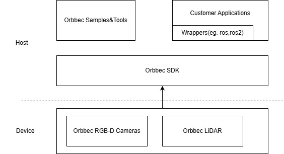

# Open Source Orbbec SDK

> [!IMPORTANT]
> Welcome to Orbbec's latest open-source Orbbec SDK! Before you begin using this version of the SDK, it's crucial to check the [device support list](#12-supported-devices) to verify that your device is supported to ensure compatibility.

Here is the device support list of OrbbecSDK v1 (v1.x) and Orbbec SDK v2 (v2.x):

<table border="1" style="border-collapse: collapse; text-align: left; width: 100%;">
  <thead>
    <tr style="background-color: #1f4e78; color: white; text-align: center;">
      <th>Product Series</th>
      <th>Product</th>
      <th><a href="https://github.com/orbbec/OrbbecSDK/tree/main" style="color: black; text-decoration: none;">Orbbec SDK v1</a></th>
      <th><a href="https://github.com/orbbec/OrbbecSDK_v2" style="color: black; text-decoration: none;">Orbbec SDK v2</a></th>
    </tr>
  </thead>
  <tbody>
      <tr>
      <td style="text-align: center; font-weight: bold;">Gemini 435Le</td>
      <td>Gemini 435Le</td>
      <td>not supported</td>
      <td>recommended for new designs</td>
    </tr>
    <tr>
      <td rowspan="8" style="text-align: center; font-weight: bold;">Gemini 330</td>
      <td>Gemini 335Le</td>
      <td>not supported</td>
      <td>recommended for new designs</td>
    </tr>
    <tr>
      <td>Gemini 335</td>
      <td>full maintenance</td>
      <td>recommended for new designs</td>
    </tr>
    <tr>
      <td>Gemini 336</td>
      <td>full maintenance</td>
      <td>recommended for new designs</td>
    </tr>
    <tr>
      <td>Gemini 330</td>
      <td>full maintenance</td>
      <td>recommended for new designs</td>
    </tr>
    <tr>
      <td>Gemini 335L</td>
      <td>full maintenance</td>
      <td>recommended for new designs</td>
    </tr>
    <tr>
      <td>Gemini 336L</td>
      <td>full maintenance</td>
      <td>recommended for new designs</td>
    </tr>
    <tr>
      <td>Gemini 330L</td>
      <td>full maintenance</td>
      <td>recommended for new designs</td>
    </tr>
    <tr>
      <td>Gemini 335Lg</td>
      <td>not supported</td>
      <td>recommended for new designs</td>
    </tr>
    <tr>
      <td rowspan="5" style="text-align: center; font-weight: bold;">Gemini 2</td>
      <td>Gemini 2</td>
      <td>full maintenance</td>
      <td>recommended for new designs</td>
    </tr>
    <tr>
      <td>Gemini 2 L</td>
      <td>full maintenance</td>
      <td>recommended for new designs</td>
    </tr>
    <tr>
      <td>Gemini 2 XL</td>
      <td>recommended for new designs</td>
      <td>to be supported</td>
    </tr>
    <tr>
      <td>Gemini 215</td>
      <td>not supported</td>
      <td>recommended for new designs</td>
    </tr>
    <tr>
      <td>Gemini 210</td>
      <td>not supported</td>
      <td>recommended for new designs</td>
    </tr>
    <tr>
      <td rowspan="3" style="text-align: center; font-weight: bold;">Femto</td>
      <td>Femto Bolt</td>
      <td>full maintenance</td>
      <td>recommended for new designs</td>
    </tr>
    <tr>
      <td>Femto Mega</td>
      <td>full maintenance</td>
      <td>recommended for new designs</td>
    </tr>
    <tr>
      <td>Femto Mega I</td>
      <td>full maintenance</td>
      <td>recommended for new designs</td>
    </tr>
    <tr>
      <td rowspan="3" style="text-align: center; font-weight: bold;">Astra</td>
      <td>Astra 2</td>
      <td>full maintenance</td>
      <td>recommended for new designs</td>
    </tr>
    <tr>
      <td>Astra+</td>
      <td>limited maintenance</td>
      <td>not supported</td>
    </tr>
    <tr>
      <td>Astra Pro Plus</td>
      <td>limited maintenance</td>
      <td>not supported</td>
    </tr>
    <tr>
      <td style="text-align: center; font-weight: bold;">Astra Mini</td>
      <td>Astra Mini Pro</td>
      <td>full maintenance</td>
      <td>not supported</td>
    </tr>
  </tbody>
</table>

**Note**: If you do not find your device, please contact our FAE or sales representative for help.

**Definition**:

1. recommended for new designs: we will provide full supports with new features,  bug fix and performance optimization;
2. full maintenance: we will provide bug fix support;
3. limited maintenance: we will provide critical bug fix support;
4. not supported: we will not support specific device in this version;
5. to be supported: we will add support in the near future.


## 1. Introduction

This is the open source library of the Orbbec SDK v2.x. The Orbbec SDK is a cross-platform library for interfacing with the Orbbec RGB-D cameras. It provides C/C++ APIs and many other languages or frameworks [wrappers](wrappers/README.md).

<div align=center>

</div>

To enhance performance and accommodate the diverse needs of our customers, the Orbbec SDK has been open source since version 2.0.0. For projects currently utilizing version Orbbec SDK v1.x that are considering an upgrade to Orbbec SDK v2.x, we advise using the pre-compiled binaries available in the [Release](https://github.com/orbbec/OrbbecSDK_v2/releases) page. This ensures a seamless transition and maintains consistency with your existing setup.

We have made every effort to maintain backward compatibility with our APIs. However, in pursuit of enhanced performance and an improved user experience, we have made necessary updates. Some interfaces have been removed or altered due to infrequent use or design imperfections. These changes are intended to be minimally disruptive and should not interfere with the standard functionality of the SDK.

For a detailed list of features not available in the current version, please refer to our documentation: [features_not_available_at_v2.x.x](docs/api/features_not_available_at_v2.x.x.md).

Additionally, a comprehensive overview of the API changes from Orbbec SDK v1.x to v2.x.x can be found here: [api_changes_at_v2.x.x](docs/api/api_changes_at_v2.x.x.md).

If you prefer to continue with Orbbec SDK v1.x, you can still access the pre-compiled binaries on our [Orbbec SDK](https://github.com/orbbec/OrbbecSDK) repository. Nonetheless, we encourage you to consider transitioning to Orbbec SDK v2.x. This move will allow you to take advantage of  improved and new features and ensure ongoing support. Our dedication to v2.x is part of a broader strategy aimed at delivering robust long-term support, fostering an open-source community, and driving innovation.

### 1.1 Supported Platforms

- Windows 10 or later: x86 and x64 architectures
- Linux x64: tested on Ubuntu 20.04, 22.04 and 24.04
- Linux ARM64: tested on  NVIDIA Jetson AGX Orin , NVIDIA Jetson Orin NX , NVIDIA Jetson Orin Nano , NVIDIA Jetson AGX Xavier , NVIDIA Jetson Xavier NX 
- [Android](https://github.com/orbbec/OrbbecSDK-Android-Wrapper/tree/v2-main): tested on Android 13
- macOS: coming soon

### 1.2 Supported Devices

| **Products List** | **Minimal Firmware Version** | **Recommended FW Version**    |
|-------------------|------------------------------|-------------------------------|
| Gemini 435Le        | 1.2.4                     |        1.3.2                   |
| Gemini 335Le        | 1.5.31                     |        1.5.55                     |
| Gemini 330        | 1.2.20                       |        1.5.55                       |
| Gemini 330L       | 1.2.20                       |       1.5.55                      |
| Gemini 335        | 1.2.20                       |       1.5.55                        |
| Gemini 335L       | 1.2.20                       |        1.5.55                       |
| Gemini 336        | 1.2.20                       |       1.5.55                        |
| Gemini 336L       | 1.2.20                       |        1.5.55                       |
| Gemini 335Lg      | 1.3.46                       |        1.5.55                       |
| Femto Bolt        | 1.1.2                  |              1.1.2                       |
| Femto Mega        | 1.3.0                  |              1.3.1                       |
| Femto Mega I        | 2.0.4                  |            2.0.4                     |
| Astra 2           | 2.8.20                       |         2.8.20                      |
| Gemini 2 L        | 1.4.53                       |        1.5.2                       |
| Gemini 2          | 1.4.92               |                1.4.98                       |
| Gemini 215        | 1.0.9                        |        1.0.9                      |
| Gemini 210        | 1.0.9                        |        1.0.9                      |

For optimal performance, we strongly recommend updating to the latest firmware version. This ensures that you benefit from the most recent enhancements and bug fixes.

More devices support will be added in the near future. If you can not find your device in the table above currently, try the version v1.x.y at [Orbbec SDK](https://github.com/orbbec/OrbbecSDK)

## 2. Documentation

*The Orbbec SDK documentation is available on [GitHub Pages](https://orbbec.github.io/OrbbecSDK_v2/).*

### 2.1 Environment Setup

#### windows

For windows, you need to register the metadata associated with frames (this includes things like timestamps and other information about the video frame).

- Metadata registration follow this:[/scripts/env_setup/obsensor_metadata_win10.md](scripts/env_setup/obsensor_metadata_win10.md)

*Notes: If the metadata is not registered, the device timestamp will be abnormal, thereby affecting the SDK’s internal frame synchronization functionality.*

#### Linux

For Linux, we have provided a script to help you set up the environment. You can run the script as follows:

```bash
cd scripts/env_setup
  sudo chmod +x ./install_udev_rules.sh
  sudo ./install_udev_rules.sh
  sudo udevadm control --reload && sudo udevadm trigger
```

*Notes: If this script is not executed, open the device will fail due to permission issues. You need to run the sample with sudo (administrator privileges).*


### 2.2 How to Use install package
If you do not want to compile the Orbbec SDK, you can use the SDK installation package. First [download the corresponding installation package](https://github.com/orbbec/OrbbecSDK_v2/releases) for your platform.

1. The file `OrbbecSDK_vx.x.x_win64.exe` serves as the installation package for the Orbbec SDK and Orbbec Viewer tools on Windows.
2. The file `OrbbecSDK_vx.x.x_amd64.deb` serves as the installation package for the Orbbec SDK and Orbbec Viewer tools on Linux x86_64, likes ubuntu.
3. The file `OrbbecSDK_vx.x.x_arm64.deb` serves as the installation package for the Orbbec SDK and Orbbec Viewer tools on ARM64，likes  NVIDIA Jetson AGX Orin , NVIDIA Jetson Orin NX , NVIDIA Jetson Orin Nano , NVIDIA Jetson AGX Xavier , NVIDIA Jetson Xavier NX.

#### Linux Install via .deb Package
- On the Linux x64 (ubuntu) platform, install using the following command. (If you are using the Arm64 platform, please use `OrbbecSDK_vx.x.x_arm64.deb`)
~~~
sudo dpkg -i OrbbecSDK_v2.x.x_amd64.deb
~~~

- Check the entire package path of the Orbbec SDK using dpkg -L orbbecsdk, while the header files and library files of the Orbbec SDK will be installed in the /usr/local path.
~~~
dpkg -L orbbecsdk
~~~

- Run the Orbbec Viewer.
~~~
sudo ./OrbbecViewer
~~~

#### Windows Install via .exe Package
On the windows platform, Double-click OrbbecSDK_vx.x.x_win64.exe directly to install, After installation is complete, run OrbbecViewer or the Orbbec SDK from the installation directory.

### 2.3 Quick Start

If you do not intend to modify the SDK itself, it is recommended to use a [pre-compiled distribution](https://github.com/orbbec/OrbbecSDK_v2/releases). For a comprehensive guide on installing the SDK, setting up your development environment, and developing applications, please consult the [Tutorial](docs/tutorial/installation_and_development_guide.md) section for detailed information.

To explore practical examples and gain insights on utilizing the SDK, please navigate to [Examples](examples/README.md) section for more information.

Orbbec Viewer is an all-in-one graphical user interface (GUI) built on the Orbbec SDK, offering a suite of features including data stream preview, camera configuration, post-processing, and more. To learn how to effectively use the Orbbec Viewer, please refer to the  [Orbbec Viewer User Guide](docs/tutorial/orbbecviewer.md).

### 2.4 API Reference

[Orbbec SDK v2 API User Guide](https://orbbec.github.io/docs/OrbbecSDKv2_API_User_Guide/), this document provides an overview of key features in the Orbbec SDK v2 and demonstrates how to use its most commonly used APIs. For more detailed APIs, please refer to [Orbbec_SDK_API_Reference.html](https://orbbec.github.io/docs/OrbbecSDKv2/index.html)

### 2.5 Performance tuning

For different use cases, the SDK can be tuned to achieve optimal performance. Please refer to the [performance tuning guide](docs/tutorial/performance_tuning.md) for more information.

### 2.6 Building from Source

If you would like to modify the SDK itself, you can build the SDK from source. Please refer to the [build guide](docs/tutorial/building_orbbec_sdk.md) for more information.

### 2.7 FAQ

Most frequently asked questions can be found in the [FAQ](docs/FAQ.md) file.

More asked and answered questions can be found in the [issues](https://github.com/orbbec/OrbbecSDK_v2/issues) channel. Use key words for searching may help you find the answer you are looking for.

## 3. Gallery

### 3.1 The QuickStart Example

```c++
// Create a pipeline.
ob::Pipeline pipe;

// Start the pipeline with default config.
pipe.start();

// Create a window for showing the frames, and set the size of the window.
ob_smpl::CVWindow win("QuickStart", 1280, 720, ob_smpl::ARRANGE_ONE_ROW);

while(win.run()) {
    // Wait for frameSet from the pipeline, the default timeout is 1000ms.
    auto frameSet = pipe.waitForFrameset();

    // Push the frames to the window for showing.
    win.pushFramesToView(frameSet);
}

// Stop the Pipeline, no frame data will be generated
pipe.stop();
```


### 3.2 The Orbbec Viewer


- Notes

If the Orbbec Viewer is used under Linux OS and is used for updating any camera firmware, users may encounter the issue that the firmware file selection window is not poping up. Users are unable to proceed with the firmware update work flow and are unable to update the camera firmware.

- Solution:
1. Exit the Orbbec Viewer under Linux OS .
2. Run the following command as root in a terminal for installing the necessary tool Zenity.
```
sudo apt-get install zenity
```

3. Start the Orbbec Viewer under Linux OS and proceed with the firmware update work flow.


## 4. Contributing

At present, we are focusing our efforts on the internal development of the SDK and are not accepting external contributions for functionality expansion. However, we value your input and are open to reviewing any pull requests or suggestions you might have.

Should you have any questions or concerns, please feel free to reach out to us through the [issues](https://github.com/orbbec/OrbbecSDK_v2/issues) channel.

## 5. License

This project is licensed under the MIT License with some other licenses for third-party libraries and extensions - see the [LICENSE](LICENSE.txt) file for details.

## 6. Links

- [Orbbec SDK V2.x Open Source Library](https://github.com/orbbec/OrbbecSDK_v2)
- [Orbbec SDK V1.x Pre-Compiled Library](https://github.com/orbbec/OrbbecSDK)
- [Orbbec Company Main Page](https://www.orbbec.com/)
- [Orbbec 3D Club](https://3dclub.orbbec3d.com)
