# How to migrate from Orbbec SDK v1 to the open-source Orbbec SDK v2

## 1. Introduction

Orbbec initially provided a closed-source SDK, [Orbbec SDK v1](https://github.com/orbbec/OrbbecSDK). However, as developers increasingly demanded flexibility, 
customizability, and code transparency, many began moving from closed-source SDKs to open-source solutions. To meet these needs, Orbbec released the official open-source project, [Orbbec SDK v2](https://github.com/orbbec/OrbbecSDK_v2), designed to deliver a more open and flexible development platform for Orbbec cameras.

This article introduces the advantages of migrating from the closed-source Orbbec SDK v1 to the open-source Orbbec SDK v2, highlights key interface changes, and provides a complete migration example.

## 2. Advantages of Migrating from Closed-Source to Open-Source SDK

### 2.1 Code Transparency

The source code of  **Orbbec SDK v1** is not publicly available, preventing developers from gaining deep insights into its internal implementation or making low-level modifications to meet their specific needs. In contrast, **Orbbec SDK v2** is fully accessible, allowing developers to freely review, analyze, and modify the source code. This transparency not only helps developers understand how the SDK works but also enables targeted optimization and feature extensions.

### 2.2 Flexibility and Customizability

With the **Orbbec SDK v1**, developers encountering customization needs or technical issues often had to rely on vendor support or wait for official updates.  **Orbbec SDK v2** provides greater autonomy and flexibility:

- (a) Customize functional modules based on specific requirements.
- (b) Optimize core algorithms (e.g., point cloud processing).
- (c) Independently fix bugs and add new features.
- (d) Leverage a plugin-based extension framework that allows developers to create custom post-processing modules for data streams.

### 2.3 Community Support

**[Orbbec SDK v2](https://github.com/orbbec/OrbbecSDK_v2)** hosted on GitHub , is backed by an active developer community. This open community offers abundant resources and interactive opportunities:

- (a) Full SDK source code and technical documentation.
- (b) Rich example code and API references.
- (c) Technical exchanges among community members.

### 2.4 Security and Privacy

Because the source code of **Orbbec SDK v2** is public, it can be reviewed by developers and security experts, enabling potential vulnerabilities to be identified and addressed early. By contrast,  **Orbbec SDK v1** functions as a “black box,” leaving developers unable to fully assess whether its internal implementation contains security flaws or risks.

### 2.5 Rapid Iteration and Updates

**Orbbec SDK v2** typically evolves faster than **Orbbec SDK v1**. Developers can contribute bug fixes, feature enhancements, or support for new technologies directly. 

### 2.6 Strategy for Device Support in the Open-Source Orbbec SDK v2

1.Support for Newly Released Devices

- **Applicable models**: For example, Gemini 335Le, Gemini 335Lg, Gemini 435Le, and all subsequent new devices.
- **Support plan**: These devices will only be supported by the latest **Orbbec SDK v2**. This strategy encourages innovation based on open standards.

2.Support for Newly Released Devices

- **Applicable models**: For example, Dabai DCW, Gemini E, Astra Mini Pro, Astra Mini S Pro, etc.
- **Core update**: Firmware upgrades will be provided to migrate their underlying communication protocol from the legacy OpenNI framework to the standard UVC (USB Video Class) protocol.
- **Post-upgrade advantage**: After upgrading to UVC firmware, these devices can integrate with Orbbec SDK v2.
- **Compatibility note**: If users choose not to upgrade and continue using firmware based on the OpenNI protocol, development will only be possible with **Orbbec SDK v1**.

## 3. API Changes from Orbbec SDK v1 to Orbbec SDK v2

Migrating from Orbbec SDK v1 to Orbbec SDK v2 may involve some interface changes. The following are several common modifications.

### 3.1 Recording Changes

In Orbbec SDK v1, recording a ".bag" file is achieved through the `ob::Pipeline` or `ob::Recorder` interface. After starting the data stream with `ob::Pipeline`, recording can be performed by calling the relevant recording interfaces. Below is a sample code snippet for recording depth streams in Orbbec SDK v1. For details, please refer to the [Recorder example](https://github.com/orbbec/OrbbecSDK/tree/main/examples/cpp/Sample-Recorder) in Orbbec SDK v1.

```cpp
ob::Pipeline pipe;

// Get depth stream configuration
auto profiles = pipe.getStreamProfileList(OB_SENSOR_DEPTH);
std::shared_ptr<ob::VideoStreamProfile> depthProfile = nullptr;
if(profiles) {
    depthProfile = std::const_pointer_cast<ob::StreamProfile>(profiles->getProfile(OB_PROFILE_DEFAULT))->as<ob::VideoStreamProfile>();
}

// Create a Config to configure which streams to enable for the Pipeline, here the depth stream will be enabled
// User can enable other type of stream, all streams that has been enabled will be recorded
std::shared_ptr<ob::Config> config = std::make_shared<ob::Config>();
config->enableStream(depthProfile);

// Start the pipeline with config
pipe.start(config);

// Start record
pipe.startRecord("./OrbbecPipeline.bag");
while(true) {
    // Wait for up to 100ms for a frameset in blocking mode.
    auto frameSet = pipe.waitForFrames(100);
    if(frameSet == nullptr) {
        continue;
    }
}

pipe.stopRecord();
// Stop the Pipeline, no frame data will be generated
pipe.stop();
```

In  Orbbec SDK v2, a new class ob::RecordDevice has been introduced for recording. By constructing ob::RecordDevice with the target device and output file path (.bag file), recording and stopping are controlled via the resume() and pause() interfaces. Below is a sample code snippet of the new recording implementation. For details, see the [ob_device_record example](https://github.com/orbbec/OrbbecSDK_v2/tree/main/examples/2.device.record).

```cpp
// Create a context, for getting devices and sensors
std::shared_ptr<ob::Context> context = std::make_shared<ob::Context>();
// Query device list
auto deviceList = context->queryDeviceList();
// Acquire first available device
auto device = deviceList->getDevice(0);
// Create a pipeline the specified device
auto pipe = std::make_shared<ob::Pipeline>(device);

// Create a config and enable all streams
std::shared_ptr<ob::Config>  config  = std::make_shared<ob::Config>();
auto sensorList = device->getSensorList();
for(uint32_t i = 0; i < sensorList->getCount(); i++) {
    auto sensorType = sensorList->getSensorType(i);
    config->enableStream(sensorType);
}

// Start all streams
pipe->start(config, [&](std::shared_ptr<ob::FrameSet> frameSet) {
    renderFrameSet = frameSet;
});

// Initialize recording device with output file
auto recordDevice = std::make_shared<ob::RecordDevice>(device, filePath);

//Start record
recorder->resume();

//...Record enough time to exit

//Stop record
recorder->pause()

pipe->stop();

// Flush and save recording file
recordDevice = nullptr;
```

### 3.2 Playback Changes

In Orbbec SDK v1, playback of ".bag" files is handled using ob::Pipeline or ob::Playback. Below is a sample code snippet for playback in Orbbec SDK v1. For details, refer to the [Playback example](https://github.com/orbbec/OrbbecSDK/tree/main/examples/cpp/Sample-Playback) in Orbbec SDK v1.

```cpp
// Create a pipeline object for playback
ob::Pipeline pipe("./OrbbecPipeline.bag");

// Get the playback object and set the playback status callback
auto playback = pipe.getPlayback();
playback->setPlaybackStateCallback([&](OBMediaState state) {
    if(state == OB_MEDIA_BEGIN) {
        std::cout << "Playback file begin." << std::endl;
    }
    else if(state == OB_MEDIA_END) {
        std::cout << "Playback file end." << std::endl;
    }
});

// Start playback by pass NULL to playback all contained streams
pipe.start(NULL);

while(true) {
    framesForRender.clear();
    // Wait for up to 100ms for a frameset in blocking mode.
    auto frameset = pipe.waitForFrames(100);
    if(frameset == nullptr) {
        continue;
    }
}

// Stop playback
pipe.stop();
```

In  Orbbec SDK v2, a new class ob::PlaybackDevice has been added for playback functionality. By constructing ob::PlaybackDevice with a .bag file, a new ob::Pipeline can be created to complete playback. Below is a code snippet for SDK v2 playback. For details, see the [ob_device_playback](https://github.com/orbbec/OrbbecSDK_v2/tree/main/examples/2.device.playback) example.

```cpp
// Create a playback device with a Rosbag file
std::shared_ptr<ob::PlaybackDevice> playback = std::make_shared<ob::PlaybackDevice>(filePath);
// Create a pipeline with the playback device
std::shared_ptr<ob::Pipeline> pipe = std::make_shared<ob::Pipeline>(playback);
// Enable all recording streams from the playback device
std::shared_ptr<ob::Config> config = std::make_shared<ob::Config>();

// Set playback status change callback, when the playback stops, start the pipeline again with the same config
playback->setPlaybackStatusChangeCallback([&](OBPlaybackStatus status) {
    if(status == OB_PLAYBACK_STOPPED && !exited) {
        pipe->stop();
        std::this_thread::sleep_for(std::chrono::milliseconds(1000));
        pipe->start(config);
    }
});

auto sensorList = playback->getSensorList();
for(uint32_t i = 0; i < sensorList->getCount(); i++) {
    auto sensorType = sensorList->getSensorType(i);

    config->enableStream(sensorType);
}

// Start the pipeline with the config
pipe->start(config);
while(true) {
    auto frameSet = pipe->waitForFrames(1000);
    if(frameSet == nullptr) {
        continue;
    }
}
pipe->stop();
```

### 3.3 UVC Backend Configuration

On Linux, there are two ways to enable the UVC backend: libuvc and V4L2. This functionality applies only to Linux platforms.

In Orbbec SDK v1, the backend is set using `setUVCBackend`.

```cpp
typedef enum {
    UVC_BACKEND_AUTO   = 0,
    UVC_BACKEND_LIBUVC = 1,
    UVC_BACKEND_V4L2   = 2,
} UVC_BACKEND, ob_uvc_backend, OBUvcBackend;

void setUVCBackend(OBUvcBackend uvcBackend);
```

In Orbbec SDK v2, the interface name and type definition have been updated. The backend is now set using `setUvcBackendType(OBUvcBackendType type)`.

```cpp
typedef enum {
    /**
     * @brief Auto detect system capabilities and device hint to select backend
     */
    OB_UVC_BACKEND_TYPE_AUTO,

    /**
     * @brief Use libuvc backend to access the UVC device
     */
    OB_UVC_BACKEND_TYPE_LIBUVC,

    /**
     * @brief Use v4l2 backend to access the UVC device
     */
    OB_UVC_BACKEND_TYPE_V4L2,

    /**
     * @brief Use MSMF backend to access the UVC device
     */
    OB_UVC_BACKEND_TYPE_MSMF,
} ob_uvc_backend_type, OBUvcBackendType;

void setUvcBackendType(OBUvcBackendType type);
```

### 3.4 Extension Lib Directory Configuration

This is a new feature introduced in Orbbec SDK v2. It allows setting the directory used to search for dynamic libraries that provide additional functionality to the SDK.

```cpp
/**
 * @brief Set the extensions directory
 * @brief The extensions directory is used to search for dynamic libraries that provide additional functionality to the SDK, such as the Frame filters.
 * @attention Should be called before creating the context and pipeline, otherwise the default extensions directory (./extensions) will be used.
 * @param directory Path to the extensions directory. If the path is empty, the existing settings will continue to be used (if the existing
 */
static void setExtensionsDirectory(const char *directory);
```

### 3.5 Global Timestamp Enable

Orbbec SDK v2 introduces a new API for enabling or disabling global timestamp output. This feature is supported only on specific devices, such as the Gemini 330 series.

```cpp
/**
 * @brief Enable or disable the global timestamp
 * @param enable Whether to enable the global timestamp
 */
void enableGlobalTimestamp(bool enable);
```

### 3.6 Firmware Update API

In Orbbec SDK v2, the firmware update APIs have been renamed and updated with different parameters. For details, please refer to the `ob_device_firmware_update` example.

The firmware update-related interfaces in  Orbbec SDK v1 are as follows:

```cpp
/**
 * @brief Upgrade the device firmware
 * @param filePath Firmware path
 * @param callback  Firmware upgrade progress and status callback
 * @param async    Whether to execute asynchronously
 */
void deviceUpgrade(const char *filePath, DeviceUpgradeCallback callback, bool async = true);

/**
 * @brief Upgrade the device firmware
 * @param fileData Firmware file data
 * @param fileSize Firmware file size
 * @param callback  Firmware upgrade progress and status callback
 * @param async    Whether to execute asynchronously
 */
void deviceUpgradeFromData(const char *fileData, uint32_t fileSize, DeviceUpgradeCallback callback, bool async = true);
```

The firmware update-related interfaces in  Orbbec SDK v2 are as follows. please refer to the [ob_device_firmware_update](https://github.com/orbbec/OrbbecSDK_v2/tree/main/examples/2.device.firmware_update) example.

```cpp
/**
* @brief Update the device firmware
* @param filePath Firmware path
* @param callback Firmware Update progress and status callback
* @param async Whether to execute asynchronously
*/
void updateFirmware(const char *filePath, DeviceFwUpdateCallback callback, bool async = true);

/**
* @brief Update the device firmware from data
* @param firmwareData Firmware data
* @param firmwareDataSize Firmware data size
* @param callback Firmware Update progress and status callback
* @param async Whether to execute asynchronously
*/
void updateFirmwareFromData(const uint8_t *firmwareData, uint32_t firmwareDataSize, DeviceFwUpdateCallback callback, bool async = true);
```

### 3.7 Heartbeat Enable API 

In Orbbec SDK v1, heartbeat was enabled via the property `OB_PROP_HEARTBEAT_BOOL = 89`.
In Orbbec SDK v2, a new API `enableHeartbeat(bool enable)` has been introduced for enabling or disabling device heartbeat.

```cpp
/**
 * @brief Enable or disable the device heartbeat.
 * @brief After enable the device heartbeat, the sdk will start a thread to send heartbeat signal to the device error every 3 seconds.
 * @attention If the device does not receive the heartbeat signal for a long time, it will be disconnected and rebooted.
 * @param[in] enable Whether to enable the device heartbeat.
 */
void enableHeartbeat(bool enable);
```

### 3.8 Intrinsics parameter API

#### (1). Using Orbbec SDK v2: 

Intrinsics are uniformly obtained from the `StreamProfile` object, simplifying the development workflow.

Applicable devices: All devices supported by Orbbec SDK v2.

```cpp
// Get the depth intrinsic
auto depthIntrinsic  = depthStreamProfile->getIntrinsic();
auto depthDistortion = depthStreamProfile->getDistortion();

// Get the color intrinsic
auto colorIntrinsic  = colorVideoProfile->getIntrinsic();
auto colorDistortion = colorVideoProfile->getDistortion();

// Get the depth to color extrinsic
auto depthToColorExtrinsic = depthVideoProfile->getExtrinsicTo(colorVideoProfile);
```

#### (2). Using Orbbec SDK v1:

In Orbbec SDK v1, the method for obtaining intrinsic parameters varies depending on the device type.

- For Gemini 330 series devices, intrinsics are obtained in the same way as in Orbbec SDK v2, directly from the StreamProfile object.
- For non-Gemini 330 series devices (e.g., Dabai DCW, Gemini E), intrinsics are obtained after starting the pipeline using specific interfaces.

```cpp
ob::Pipeline pipe;
pipe.start(config);
auto camera_param = pipe.getCameraParam();
```

### 3.9 Software D2C

In Orbbec SDK v1, software D2C  was enabled through the configuration interface:

```cpp
config->setAlignMode(ALIGN_D2C_SW_MODE);
```

In Orbbec SDK v2, Soft D2C is implemented using the Align filter, which must be explicitly called by the user. Refer to the sync_align sample for details.

```cpp
// Create a filter to align depth frame to color frame
auto depth2colorAlign = std::make_shared<ob::Align>(OB_STREAM_COLOR);
depth2colorAlign->process(frameSet);
```

### 3.10 HDR Merge

HDR Merge requires device support (e.g., Gemini 330 series).
In Orbbec SDK v1, HDR Merge was configured via structured data. For the HDR merge functionality, please refer to the [HdrMerge sample](https://github.com/orbbec/OrbbecSDK/tree/main/examples/cpp/Sample-HdrMerge).    

```cpp
// Configure and enable Hdr stream
OBHdrConfig obHdrConfig;
// Enable HDR merge
obHdrConfig.enable     = true;
obHdrConfig.exposure_1 = 7500;
obHdrConfig.gain_1     = 24;
obHdrConfig.exposure_2 = 100;
obHdrConfig.gain_2     = 16;
device->setStructuredData(OB_STRUCT_DEPTH_HDR_CONFIG, reinterpret_cast<uint8_t *>(&obHdrConfig), sizeof(OBHdrConfig));
```

In Orbbec SDK v2, the HDR Merge API has been unified with frame interleave APIs. For details, refer to the [HDR sample](https://github.com/orbbec/OrbbecSDK_v2/tree/main/examples/3.advanced.hdr)

```cpp
if( device->isFrameInterleaveSupported() ) {
    // Load frame interleave mode as 'Depth from HDR'
    device->loadFrameInterleave("Depth from HDR");
    // Enable frame interleave mode
    device->setBoolProperty(OB_PROP_FRAME_INTERLEAVE_ENABLE_BOOL, true);
}else {
    // Configure and enable Hdr stream
    OBHdrConfig obHdrConfig;
    obHdrConfig.enable     = true;  // enable HDR merge
    obHdrConfig.exposure_1 = 7500;
    obHdrConfig.gain_1     = 24;
    obHdrConfig.exposure_2 = 100;
    obHdrConfig.gain_2     = 16;
    device->setStructuredData(OB_STRUCT_DEPTH_HDR_CONFIG, reinterpret_cast<uint8_t *>(&obHdrConfig), sizeof(OBHdrConfig));
}
```

### 3.11 New Frame Interleave API

Orbbec SDK v2 introduces new APIs in Device.hpp for frame interleave functionality.  For details, see the [laser_interleave](https://github.com/orbbec/OrbbecSDK_v2/tree/main/examples/3.advanced.laser_interleave) example.

```cpp
// Load frame interleave mode as 'Laser On-Off'
device->loadFrameInterleave("Laser On-Off");
// Enable frame interleave
device->setBoolProperty(OB_PROP_FRAME_INTERLEAVE_ENABLE_BOOL, true);
```

### 3.12 New API for Updating Optional Depth Presets

Orbbec SDK v2 introduces a new API for updating optional depth presets on supported devices (e.g., Gemini 330 series).

```cpp
/**
  * @brief Update the device optional depth presets
  * @param filePathList A list(2D array) of preset file paths, each up to OB_PATH_MAX characters.
  * @param pathCount The number of the preset file paths.
  * @param callback Preset update progress and status callback
  */
void updateOptionalDepthPresets(const char filePathList[][OB_PATH_MAX], uint8_t pathCount, DeviceFwUpdateCallback callback);
```

### 3.13 New Hardware Noise Remove Filter API

Orbbec SDK v2 introduces a new API for updating optional depth presets on supported devices (e.g., Gemini 330 series).

```cpp
Device device = pipeline.GetDevice();
//Enabe hardware noise remove filter
device.SetBoolProperty(PropertyId.OB_PROP_HW_NOISE_REMOVE_FILTER_ENABLE_BOOL, true);
//Set hardware noise remove filter param, default value:0.2
device.SetFloatProperty(PropertyId.OB_PROP_HW_NOISE_REMOVE_FILTER_THRESHOLD_FLOAT, 0.2f);
```

- Enable hardware noise remove filter can reduce CPU usage. It is recommended to disable software noise remove filter when hardware noise remove filter is enabled.

```cpp
device.SetBoolProperty(PropertyId.OB_PROP_DEPTH_NOISE_REMOVAL_FILTER_BOOL, false);
```

## 4. Example of Migrating from Orbbec SDK v1 to Orbbec SDK v2

The process of migrating from  Orbbec SDK v1 to  Orbbec SDK v2 is illustrated using the QuickStart sample as an example.
Orbbec SDK v1 [QuickStart](https://github.com/orbbec/OrbbecSDK/tree/main/examples/cpp/Sample-QuickStart) sample source code:

```cpp
#include "libobsensor/hpp/Pipeline.hpp"
#include "libobsensor/hpp/Error.hpp"
#include "utils.hpp"
#include <chrono>
#define ESC 27

int main(int argc, char **argv) try {

    // Create a pipeline with default device
    ob::Pipeline pipe;
    // Start the pipeline with default config, more info please refer to the `misc/config/OrbbecSDKConfig_v1.0.xml`
    pipe.start();

    auto lastTime = std::chrono::high_resolution_clock::now();

    while(true) {
        // Check for key press and break if it's ESC
        if(kbhit() && getch() == ESC) {
            break;
        }
        auto frameSet = pipe.waitForFrames();
        if(!frameSet) {
            continue;
        }
        auto colorFrame = frameSet->colorFrame();
        auto depthFrame = frameSet->depthFrame();
        auto now        = std::chrono::high_resolution_clock::now();
        // Print the frame data every second
        if(std::chrono::duration_cast<std::chrono::seconds>(now - lastTime).count() >= 1) {
            if(colorFrame) {
                std::cout << "Color Frame: " << colorFrame->width() << "x" << colorFrame->height() << " " << colorFrame->timeStampUs() << " us" << std::endl;
            }
            if(depthFrame) {
                std::cout << "Depth Frame: " << depthFrame->width() << "x" << depthFrame->height() << " " << depthFrame->timeStampUs() << " us" << std::endl;
            }
            lastTime = now;  // Reset the timer
        }
    }

    // Stop the Pipeline, no frame data will be generated
    pipe.stop();

    return 0;
}
catch(ob::Error &e) {
    std::cerr << "function:" << e.getName() << "\nargs:" << e.getArgs() << "\nmessage:" << e.getMessage() << "\ntype:" << e.getExceptionType() << std::endl;
    exit(EXIT_FAILURE);
}
```

### 4.1 Instructions for Migration on Windows Platform

- (1). Download [Orbbec SDK v1](https://github.com/orbbec/OrbbecSDK/releases) (e.g., version v1.10.22) and [Orbbec SDK v2](https://github.com/orbbec/OrbbecSDK_v2/releases) (e.g., version v2.4.3) from github.

    Orbbec SDK v1： 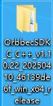 &emsp;&emsp; Orbbec SDK v2： 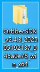 

- (2). Delete the header files in the `include` directory of  Orbbec SDK v1, and copy the header files from the `include` directory of  Orbbec SDK v2 into the `include` directory of Orbbec SDK v1.

    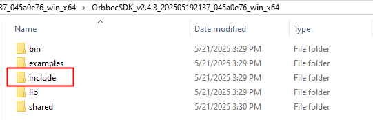 &emsp;&emsp; 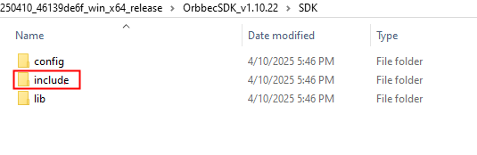 

    Orbbec SDK v2 include directory replaces Orbbec SDK v1 include directory

- (3). Delete the `library` files in the `lib` directory of  Orbbec SDK v1, and copy the `library` files from the `lib` directory of Orbbec SDK v2 (including `OrbbecSDK.dll`, `OrbbecSDKConfig.xml`, and the `extensions` directory) into the `lib` directory of the Orbbec SDK v1.

    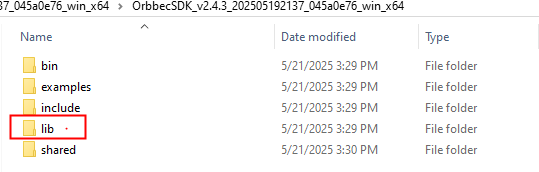 &emsp;&emsp; 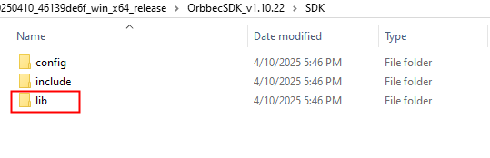 

    Copy the Orbbec SDK v2 lib directory to the OrbebcSDK v1 lib directory

- (4). Use Visual Studio 2019 for compilation. Before building, use CMake (cmake-gui) to configure the build environment as follows:

- (5). Follow steps 1, 2, 3, and 4 shown in the figure to start the configuration.

    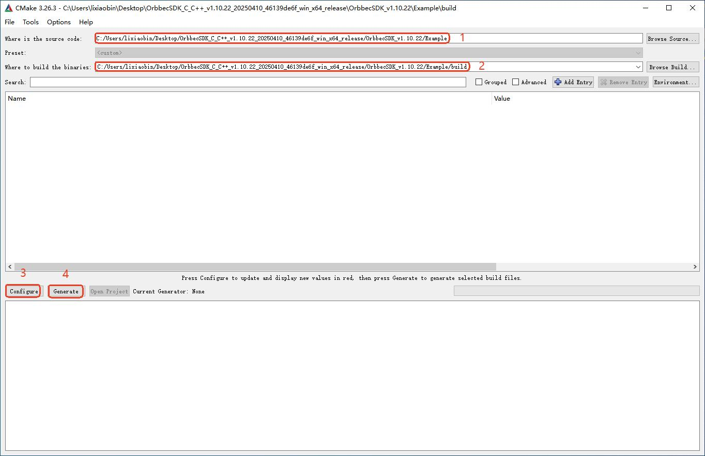

    In step 3, select the locally installed Visual Studio 2019 x64 compiler for configuration, and finally click "Finish" to start the build.

    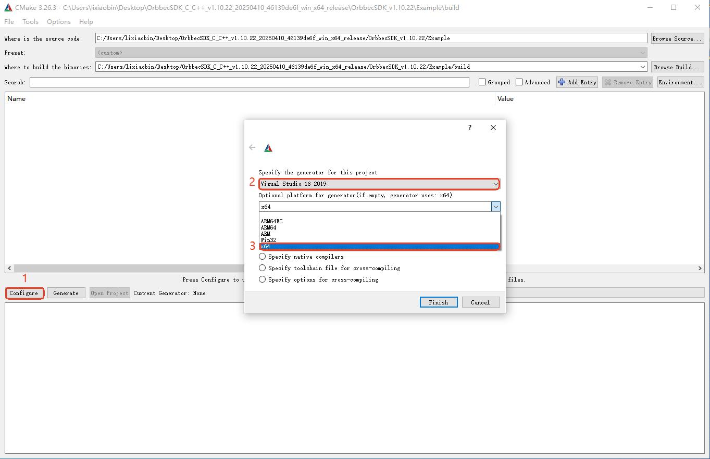

    Finally, click "Generate" to complete the project configuration.

    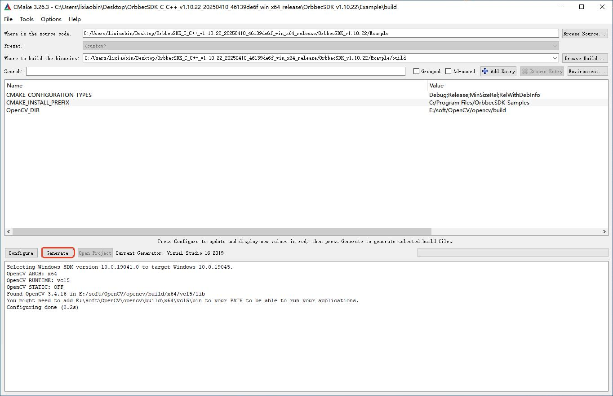

- (6).Open the project (`OrbbecSDK-Samples.sln`) using Visual Studio 2019.

    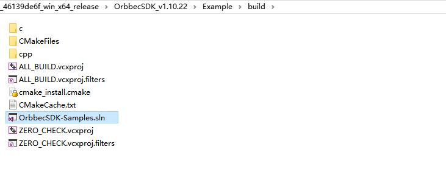

- (7).Before compilation, modify the header file includes in `QuickStart.cpp` by removing `window.hpp`, `libobsensor/hpp/Pipeline.hpp`, and `libobsensor/hpp/Error.hpp`, and including the header file `libobsensor/ObSensor.hpp`. This will prevent compilation errors, as shown in the figure below:

    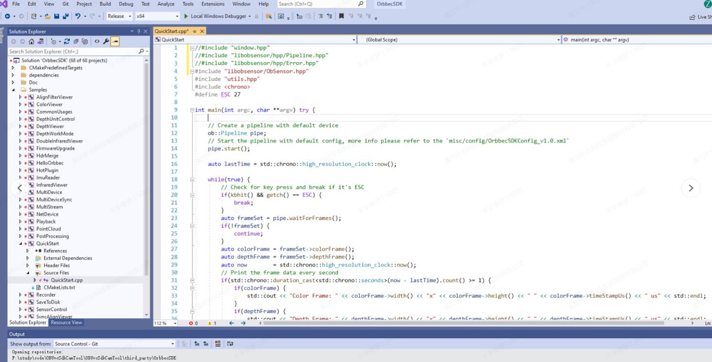
    Compile the QuickStart sample using Visual Studio 2019 by following these steps:

    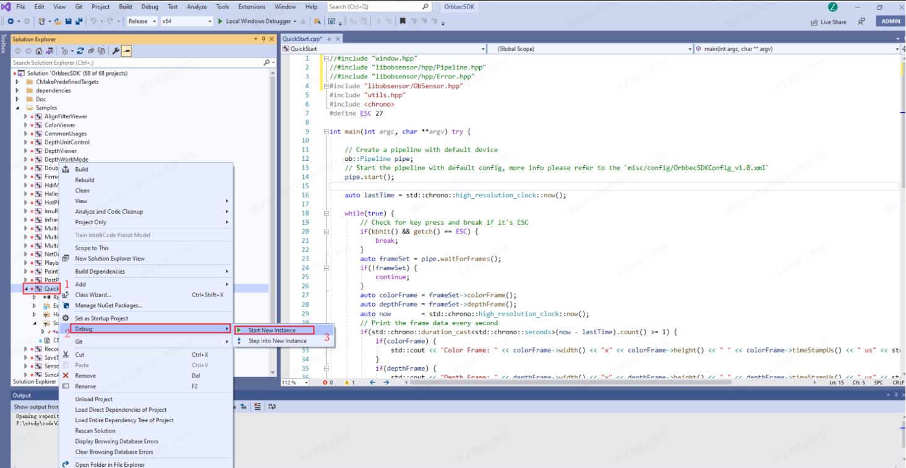

- (8).Compile the QuickStart sample of  Orbbec SDK v1. After compilation, copy the relevant library (`OrbbecSDK.dll`), configuration file (`OrbbecSDKConfig.xml`), and the `extensions` folder into the QuickStart executable project. This completes the migration from Orbbec SDK v1 to Orbbec SDK v2.

  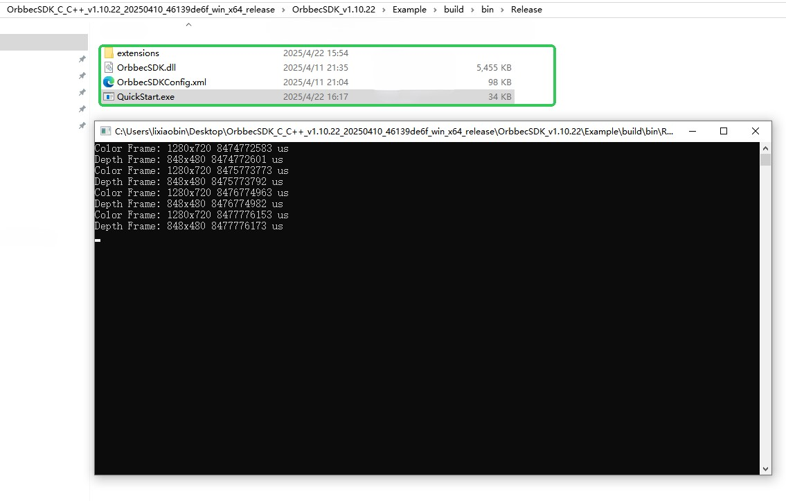

### 4.2 Instructions for Migration on Linux Platform

- (1). Download Orbbec SDK v1 (version v1.10.22 as an example) and Orbbec SDK v2 (version v2.4.3 as an example) from the official website.

    Orbbec SDK v1：  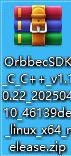 &emsp;&emsp;&emsp;Orbbec SDK v2： 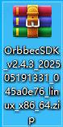
- (2). Remove the header files in  Orbbec SDK v1's "include" directory and copy the header files from Orbbec SDK v2's "include" directory into the  Orbbec SDK v1's "include" directory.
    
     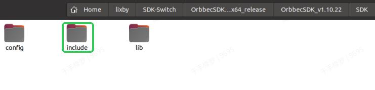&emsp;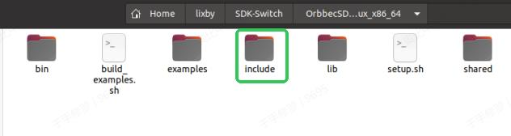

- (3). Remove the library files in  Orbbec SDK v1's "lib" directory and copy the library files from Orbbec SDK v2's "lib" directory into  Orbbec SDK v1's "lib" directory.

    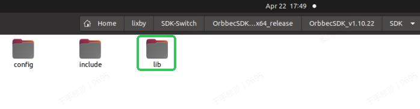&emsp;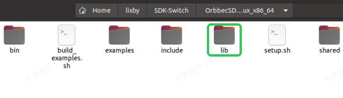

- (4). In the SDK directory (v1.10.22) under "Example," create a "build" directory, and then compile using Visual Studio Code. 

    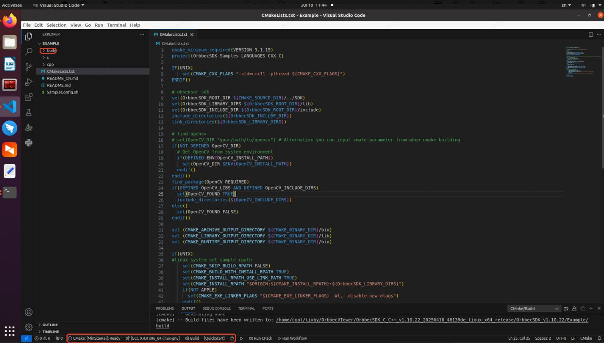

    Configure the build to be a release version. Before compiling, modify the "QuickStart.cpp" code by removing the following header files: `window.hpp`, `libobsensor/hpp/Pipeline.hpp`, and `libobsensor/hpp/Error.hpp`. Instead, include `libobsensor/ObSensor.hpp`. This will prevent compilation errors, as shown in the image below:

    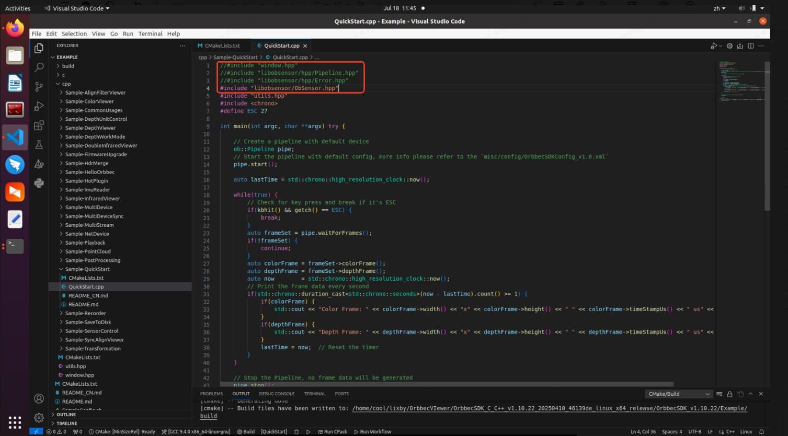

- (5). Click "Build" to start the compilation. After the compilation is complete, copy the relevant libraries (libOrbbecSDK.so, libOrbbecSDK.so.2, libOrbbecSDK.so.2.4.3), the configuration file (OrbbecSDKConfig.xml), and the libraries in the "extensions" folder to the QuickStart executable project. This completes the migration from Orbbec SDK v1 to Orbbec SDK v2.

    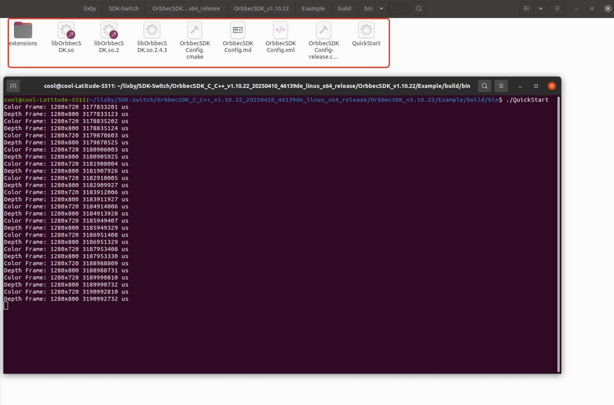