# Introduction

Orbbec Viewer is a tool developed based on Orbbec SDK to help developers quickly use Orbbec's 3D sensor products. The functional features of Orbbec 3D sensor products are realized, including functions such as reading serial numbers, obtaining device types, acquiring camera parameters, controlling cameras,etc. 

**After Orbbec SDK v2.6.2,Orbbec Viewer support LiDAR devices such as Pulsar ME450 and Pulsar SL450**.

This document describes these functions and demonstrates the basic usage process.

# Supported Platforms

| **Operating system** | **Requirement** | **Notes** |
| --- | --- | --- |
| Windows | - Windows 10 April 2018 (version 1803, operating system build 17134) release (x64) or higher - 4 GB RAM - USB2.0 and above ports  |  |
| Linux | - Linux Ubuntu 18.04/20.04/22.04/24.04 (x64) - 4 GB RAM - USB2.0 and above ports  ||
| Arm64 |  - Linux Ubuntu 18.04/20.04/22.04 - 4 GB RAM - USB2.0 and above ports  | tested on  NVIDIA Jetson AGX Orin , NVIDIA Jetson Orin NX , NVIDIA Jetson Orin Nano , NVIDIA Jetson AGX Xavier , NVIDIA Jetson Xavier NX  |
| MacOS      | M series chip, 11.0 and above; Intel x86 chip, 10.15 and above.|  unsupport Femto Bolt |

# OrbbecViewer Usage for 3D Camera
This document takes the Gemini 330 series as an example to illustrate the camera’s features. Functionality may vary across different devices. It corresponds to OrbbecViewer version **2.6.2**, and the interface may differ in other versions. Please refer to the actual OrbbecViewer for details.

As shown in the figure, the main interface is marked with three areas separated by red boxes. 

| **Area** | **Name** | **Function** |
| --- | --- | --- |
| Area 1 | Equipment management area | Sensor list |
| Area 2 | Control panel area | Data stream switch and parameter configuration, image acquisition function control, D2C function control |
| Area 3 | Image preview area | Sensor image preview, frame rate, timestamp and other information viewing |

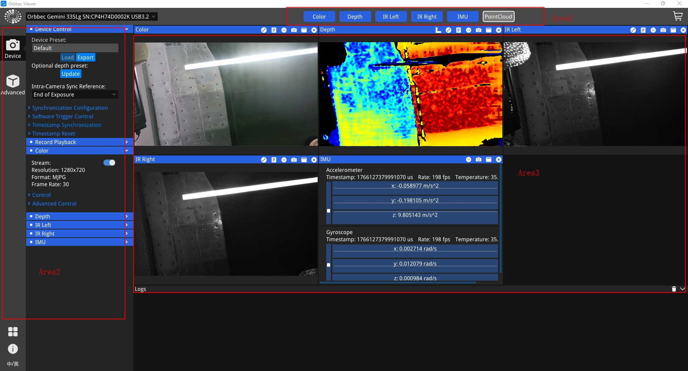

Among them, there are six buttons on the left side of the control panel area, the bottom button.

 Used to switch between Chinese and English; Used to open the software details page.

 Used to view device information and firmware upgrade; the remaining two buttons are used to switch the control panel TAB pages of different functions, from top to bottom, it is "Single Camera Mode" and "Advanced Mode".

Click the Log information at the bottom of area 3, and the specific log information will be displayed.

## Device Control
Open the "Device Control" tab and the following setting items will appear.

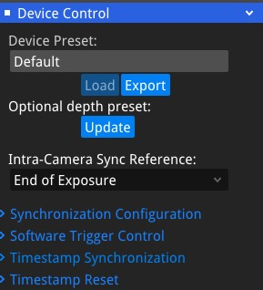

- "Preset" is a variety of preset provided by Orbbec. It has provided the most suitable product configuration for scenarios with specific needs to provide depth quality that meets the needs. Currently includes: Default, High Accuracy, High Density, Medium Density, Hand and one user-defined preset called Custom.

- "Intra-Camera Sync Reference" is used to set the reference point for the camera timestamp.
**Start of Exposure** indicates that the timestamp corresponds to the start of the exposure.
**Middle of Exposure** indicates that the timestamp corresponds to the middle of the exposure.
**End of Exposure** indicates that the timestamp corresponds to the end of the exposure.
**This parameter is currently only effective when the sync mode is set to trigger mode**.

- "Synchronization Configuration"  allows control over the camera's frame synchronization (between depth and RGB) or multi-device synchronization (among multiple devices). 

- "Software Trigger Control" allows timed or manual capture and is only effective when the sync mode is set to Software Trigger mode.

- "Timestamp Synchronization" synchronizes the device clock with the host time.

- "Timestamp Reset" resets the device's timestamp, starting the count from zero.

## Data stream 

OrbbecViewer allows the user to select and configure depth, infrared and color data streams. This section outlines the parameters that the user can customize in the tool. After the user completes the configuration, they must click the top button to start data streaming.

The OrbbecViewer tool allows users to select a combination of depth, infrared, color and IMU data streams. Users can enable or disable streams by checking or unchecking them from the list of available streams. The viewer supports USB 2.0/3.0, GMSL, and network cameras.

### Depth

- Depth includes features such as resolution, frame rate, format, exposure, gain, laser control, Noise Removal Filter, and post-processing filters.

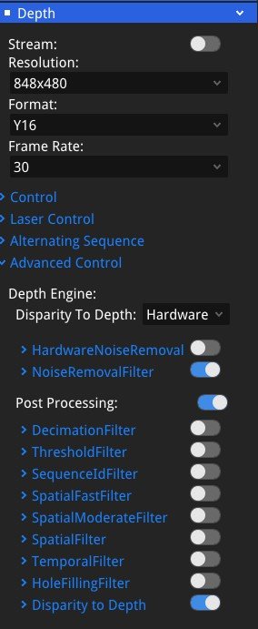

- Alternating Sequence: **Sequence Preset** includes "Depth from HDR" and "Laser On-Off". 

First, select a Sequence Preset and click **Load Sequence Preset** then enable the sequence by toggling the Enabled switch.

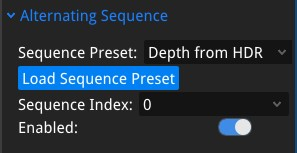

"Laser On-Off": alternates the laser between on and off states.

"Depth from HDR": The Orbbec Gemini 330 series cameras support Depth HDR function, which involves applying different exposure times and gains to depth data. Typically, this includes one long exposure time and one short exposure time, allowing for the capture of different scene effects with varied exposure settings to enhance the dynamic range of the capture results.  The captured frames are then using HDR merge to produce HDR depth output (**advanced->Depth HDR**).

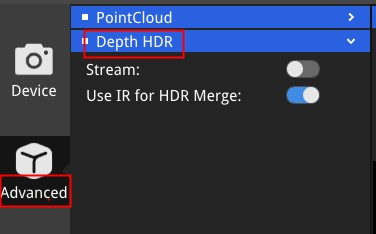

- "Disparity to Depth": **Hardware** indicates that the disparity-to-depth conversion is performed on the device, while **Software** indicates that the conversion is performed by the Orbbec SDK. 

### IR

IR includes features such as resolution, frame rate, format, exposure, gain and post-processing filters.

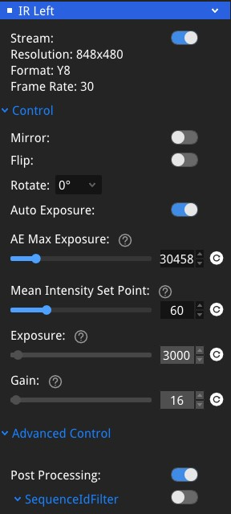

### Color

Color includes features such as resolution, frame rate, format, exposure, gain,Brightness,White balance,Sharpness,Gamma,Saturation,Contrast,Hue,Backlight Comprensation .

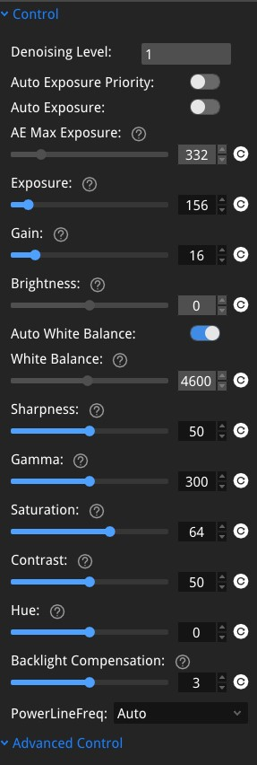

### IMU
Including Imu param.

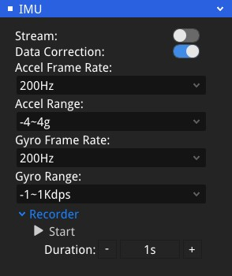

### Record Playback

Including recording, playback, and image saving features.

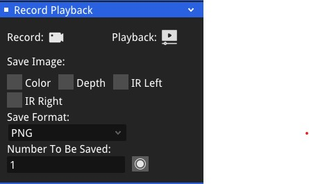

## Image preview area

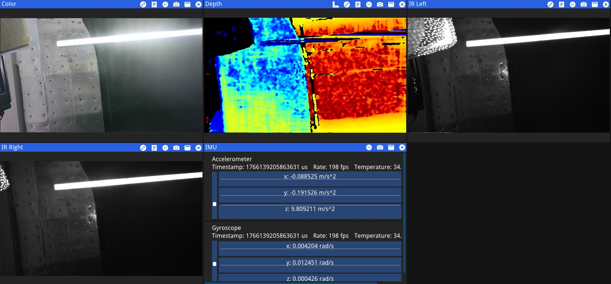

Buttons above the preview window function as the table below：

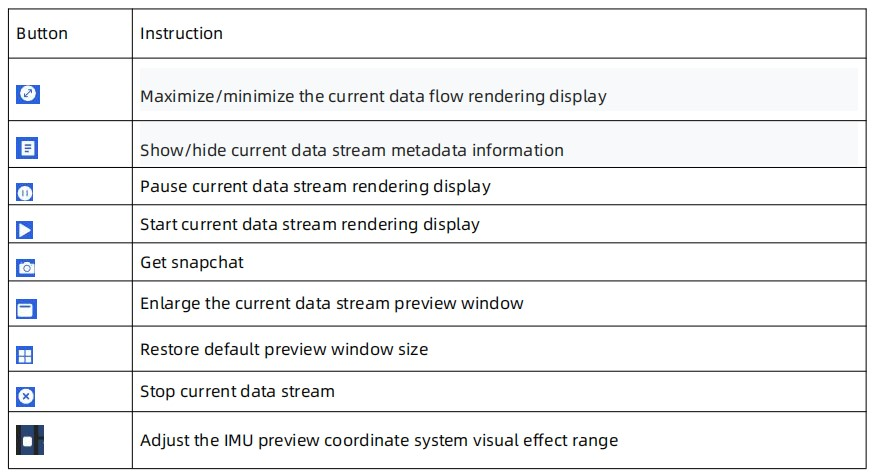

## D2C and Point Cloud (support hardware D2C and software D2C)

In advanced mode, both D2C and point clouds are supported.

* Control depth and color alignment, and the alignment mode supports hardware D2C and software D2C.
* Frame synchronization： Enables or disables the frame synchronization function. When frame synchronization is enabled, the SDK will combine Depth and Color into a FrameSet based on the device hardware timestamp, which can only be supported by devices that support frame synchronization, such as: Gemini 435Le、Gemini 330 series Gemini2、Gemini2 L、Astra2、Femto Mega、Femto Bolt。
* Match Target Res: Match target resolution,for example, when D2C is enabled, selecting this option sets the depth resolution equal to the color resolution. If not selected, the depth resolution will be lower than the color resolution while keeping the same aspect ratio.
* Decimation Filter Factor: Point Cloud Decimation Factor.
* Image View： Display and save 2D images.
* Point Cloud View： Display and save 3D PointCloud data.

  You can choose to export the depth point cloud (xyz) or RGBD point cloud (xyzrgb) and save it as a ply format file, which is saved in the "OrbbecViewer/output/PointCloud" directory by default.

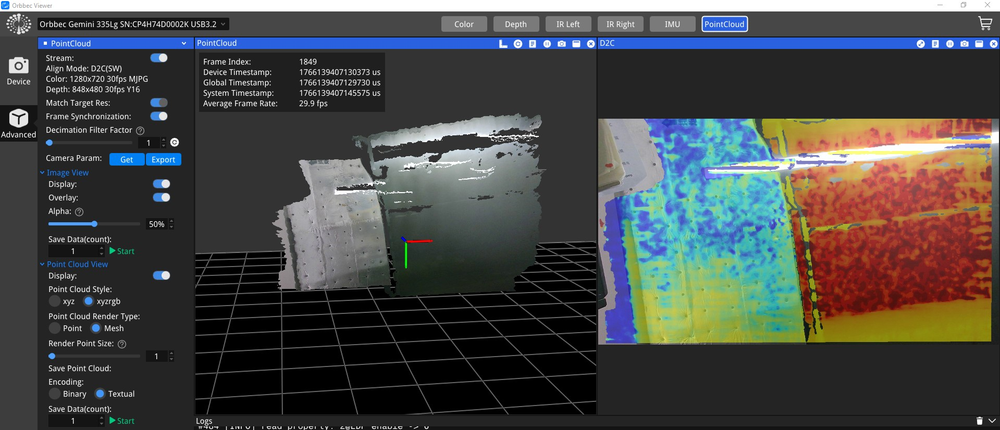

## Device Information

Click the button“  ”to view device information.
The OrbbecViewer tool contains simple device information such as firmware version, product identification code, temperature, etc.

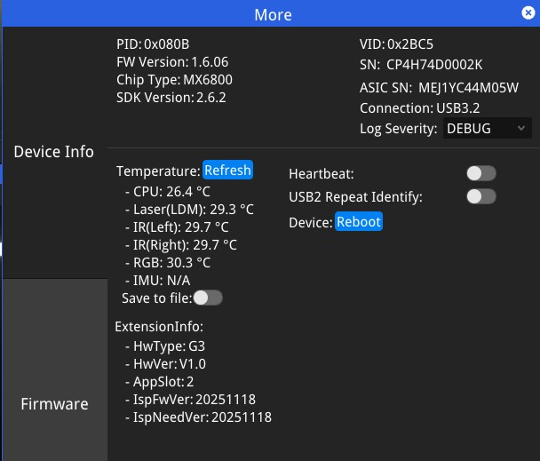

- Heartbeat: When enabled, the heartbeat messages carry firmware logs and are primarily used for debugging.

- USB2 Repeat Identify:When enabled, the firmware automatically resets if the device is detected as USB 2.0, retrying up to three times.

## **Firmware update**

When the device is connected, clickAccess the firmware update page. The firmware storage path can be found at https://github.com/orbbec/OrbbecFirmware .

- Gemini 330 series、Gemini 435Le、Gemini 2、Gemini 2L、Astra 2、Gemini 215、Gemini 210 Upgrade interface:

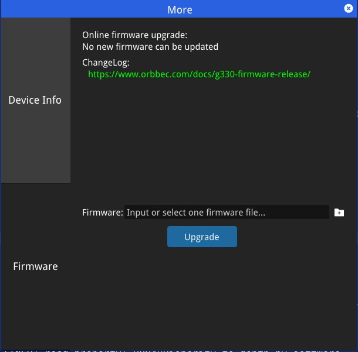

- Femto Mega firmware upgrade does not support Windows upgrade, you need to call OrbbecViewer with administrator privileges under linux. Femto Mega Firmware upgrade please refer to [Femto Mega Firmware upgrade document](https://github.com/orbbec/OrbbecFirmware/releases/tag/Femto-Mega-Firmware)

- Femto Bolt Firmware upgrade please refer to [Femto Bolt Firmware upgrade document](https://github.com/orbbec/OrbbecFirmware/releases/tag/Femto-Bolt-Firmware)

- Femto Mega I Firmware upgrade please refer to [Femto Mega I Firmware upgrade document](https://github.com/orbbec/OrbbecFirmware/releases/tag/Femto-Mega-I-Firmware)

- Astra mini Pro Firmware upgrade please refer to [Astra mini pro Firmware upgrade document](https://github.com/orbbec/OrbbecFirmware/releases/tag/Astra-Mini-Pro)

- Astra mini S Pro Firmware upgrade please refer to [Astra mini S Pro Firmware upgrade document](https://github.com/orbbec/OrbbecFirmware/releases/tag/Astra-Mini-S-Pro)

**Notes:  OrbbecViewer unsupport LiDAR Pulsar ME450 firmware upgrade**

## **Log Information**

By default, the log information area is displayed in a single-folded state. By clicking the button on the far right.Expand to view full log information.  By clicking the buttonwill empty the log. By clicking the buttonrestores the collapsed single bar display state.
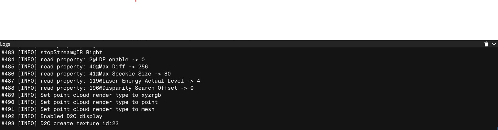

# OrbbecViewer for LiDAR

##  Main interface of LiDAR 
As shown in the figure, the main interface is marked with three areas separated by red boxes. The functions are:

| **Area** | **Name** | **Function** |
| --- | --- | --- |
| Area 1 | Equipment management area | Sensor list|
| Area 2 | Control panel area | Data stream switch and parameter configuration, point cloud acquisition function control |
| Area 3 | Image preview area | LiDAR point cloud preview, frame rate, timestamp and other information viewing |

## Data stream for LiDAR

OrbbecViewer allows the user to select and configure point cloud and IMU data streams. This section outlines the parameters that the user can customize in the tool. After the user completes the configuration, they must click the top to start data streaming.

The OrbbecViewer tool allows the user to select a combination of point cloud and IMU data streams. User can enable/disable the stream by checking/unchecking from the list of available streams.

## Device Information

Click the button“  ”to view device information.
The OrbbecViewer tool contains simple device information such as firmware version, product identification code, serial number, etc.

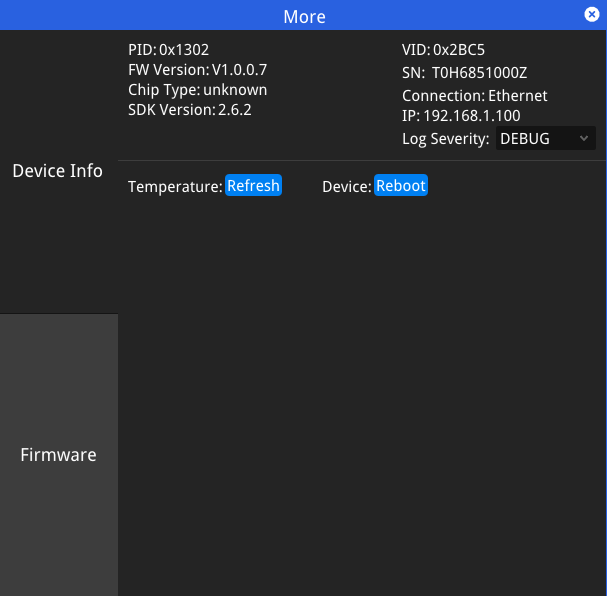

### LiDAR Point Cloud Data

After starting the point cloud data stream, the real-time point cloud effect will be displayed in the viewing area. It also supports bringing up the data table during real-time acquisition and pause. The user can hold down the "Shift" key and long-press the left mouse button to move and frame-select data, the selected data will be displayed and counted on the right side of the point cloud display panel.

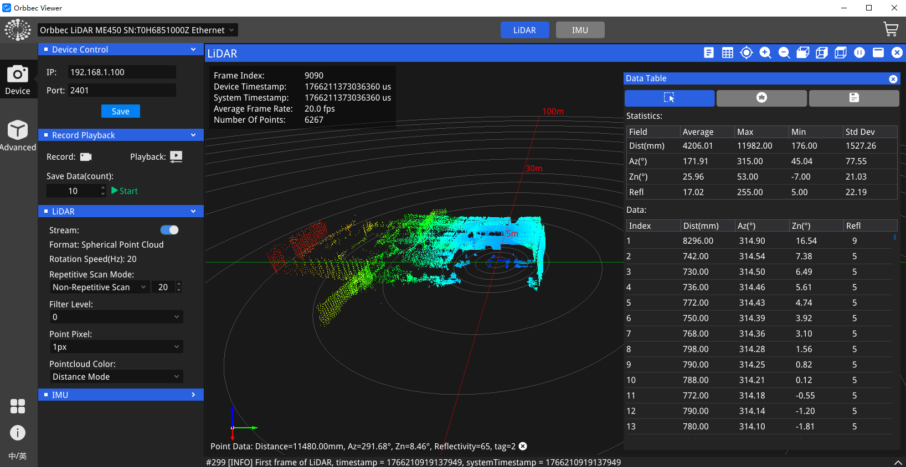

### LiDAR IMU Data

After starting the IMU data stream, the accelerometer and gyroscope data will be displayed in real time. You can adjust the sampling rate, measuring range, and other parameters of the IMU via the control panel on the left. You can also click the recording button to save the IMU data to a CSV file.

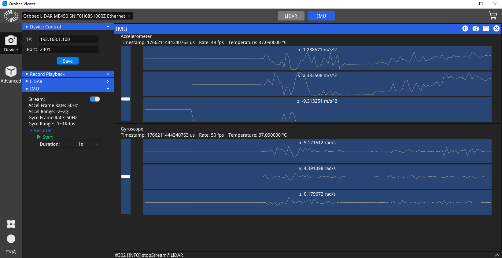

## Control Panel Area

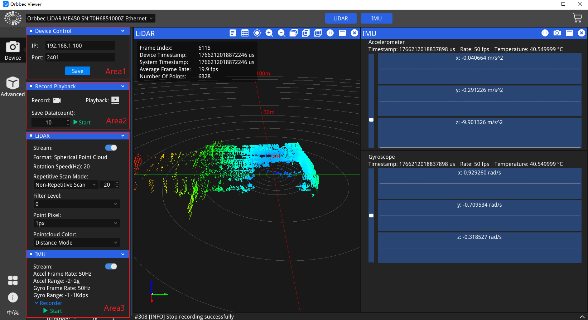

**Device Control**

In the "Area1" section of the control panel, you can modify the network IP and port configurations of the LiDAR. After making changes, you need to click the "Save" button, and the settings will take effect only after the LiDAR is restarted.

**Record Playback**

In the "Area2" section of the control panel, you can click the "Record" button to save the point cloud and IMU data to a local `.bag` file. After saving, you can click the "Playback" button, select a local `.bag` file, and replay the point cloud and IMU data.

**Sensor Settings**

In the "Area3" section of the control panel, you can modify the configurations of the LiDAR and IMU. Several commonly used configurations are introduced as follows:

- **Format**: Configures the point cloud stream format, which supports two options: "Spherical Point Cloud" and "Cartesian Point Cloud". This setting is only available when the data stream is stopped.
- **Rotation Speed**: Configures the rotation speed of the LiDAR. This setting is only available when the data stream is stopped.
- **Repetitive Scan Mode**: The repetitive scanning mode offers four options: non-repetitive scan, repetitive scan ×1, repetitive scan ×2, and repetitive scan ×4. The modification of this parameter will take effect only after the LiDAR is powered off and restarted.
- **Filter Level**: Serves to filter the generated trailing points. A higher value indicates stronger filtering effect, and a value of 0 means no filtering is applied.