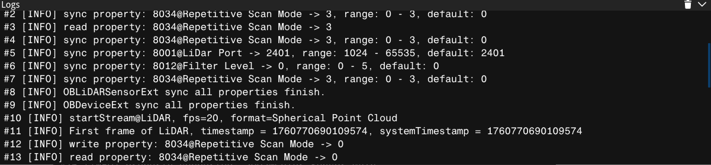

# Introduction

Orbbec Viewer is a tool developed based on Orbbec SDK to help developers quickly use Orbbec's LiDAR products. The functional features of Orbbec LiDAR products are realized, including functions such as reading serial numbers, obtaining device types, acquiring LiDAR parameters, controlling LiDAR devices, etc.

This document describes these functions and demonstrates the basic usage process.

# Overview

## Target users

The OrbbecViewer tool is designed for end users/developers to use Orbbec SDK LiDAR devices.

## Supported Platforms

| **Operating system** | **Requirement** | **Description** |
| --- | --- | --- |
| Windows | - Windows 10 April 2018 (version 1803, operating system build 17134) release (x64) or higher - 4 GB RAM - USB2.0 and above ports  | The generation of the VS project depends on the installation of the VS version and the cmake version, and supports VS2015/vs2017/vs2019 |
| Linux | - Linux Ubuntu 16.04/18.04/20.04 (x64) - 4 GB RAM - USB2.0 and above ports  |Support GCC 7.5|
| Arm64 |  - Linux Ubuntu 18.04/20.04/22.04 - 4 GB RAM - USB2.0 and above ports  |  Support GCC 7.5 |

# OrbbecViewer Usage

## 3.1 Main interface of the software

As shown in the figure, the main interface is marked with three areas separated by red boxes. The functions are:

| **Area** | **Name** | **Function** |
| --- | --- | --- |
| Area 1 | Equipment management area | Sensor list,|
| Area 2 | Control panel area | Data stream switch and parameter configuration, point cloud acquisition function control |
| Area 3 | Image preview area | LiDAR point cloud preview, frame rate, timestamp and other information viewing |

Among them, there are six buttons on the left side of the control panel area, the bottom button.

 Used to switch between Chinese and English;

 Used to open the software details page.

 Used to view device information and firmware upgrade; 

the remaining two buttons are used to switch the control panel TAB pages of different functions, from top to bottom, it is "Single LiDAR Mode" and "Advanced Mode".

Click the Log information at the bottom of Area3, and the specific log information will be displayed.

## 3.2 Data Stream

OrbbecViewer allows the user to select and configure point cloud and IMU data streams. This section outlines the parameters that the user can customize in the tool. After the user completes the configuration, they must click the top to start data streaming.

The OrbbecViewer tool allows the user to select a combination of point cloud and IMU data streams. User can enable/disable the stream by checking/unchecking from the list of available streams.

## 3.3 Device Information

Click the button“  ”to view device information.
The OrbbecViewer tool contains simple device information such as firmware version, product identification code, camera parameters, temperature, etc.

## 3.4 Data Preview Area

## 3.5 Control Panel Area

## 3.8 **Log Information**

By default, the log information area is displayed in a single-folded state. By clicking the button on the far right.Expand to view full log information.  By clicking the buttonwill empty the log. By clicking the buttonrestores the collapsed single bar display state.
