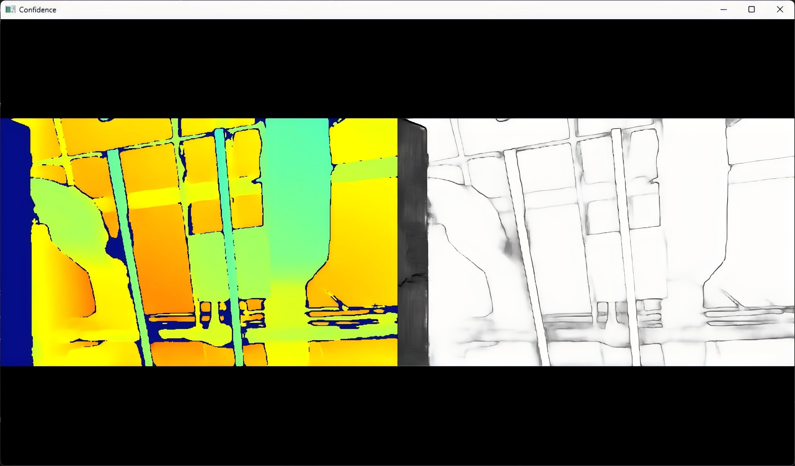

# C++ Sample: 1.stream.confidence

## Overview

Use the SDK interface to obtain the depth and confidence stream of the camera and display them in the window

### Knowledge

Enabling the confidence stream requires the depth stream to be active, and its resolution and frame rate must match the depth stream's.

## Code overview

1. Configure the depth and confidence streams, then start the pipeline with this configuration. All stream configurations must be completed before calling pipe.start().

    ```cpp
        // By creating config to configure which streams to enable or disable for the pipeline, here the depth stream will be enabled.
        std::shared_ptr<ob::Config> config = std::make_shared<ob::Config>();

        // Enable depth stream.
        config->enableVideoStream(OB_STREAM_DEPTH);

        // Enable confidence stream.  The resolution and fps of confidence must match depth stream.
        auto enabledProfiles = config->getEnabledStreamProfileList();
        if(enabledProfiles) {
            for(uint32_t i = 0; i < enabledProfiles->getCount(); i++) {
                auto profile = enabledProfiles->getProfile(i);
                if(profile && profile->getType() == OB_STREAM_DEPTH) {
                    auto depthProfile = profile->as<ob::VideoStreamProfile>();
                    if(depthProfile) {
                        config->enableVideoStream(OB_STREAM_CONFIDENCE, depthProfile->getWidth(), depthProfile->getHeight(), depthProfile->getFps());
                    }
                    break;
                }
            }
        }
    ```

2. After waiting for a while, get the depth and confidence stream in the frameset and display them in the window

    ```cpp
        while(win.run()) {
            // Wait for up to 100ms for a frameset in blocking mode.
            auto frameSet = pipe.waitForFrameset(100);
            if(frameSet == nullptr) {
                continue;
            }
            // Render frame in the wisndow.
            win.pushFramesToView(frameSet);
        }
    ```

## Run Sample

Press the Esc key in the window to exit the program.

### Result


