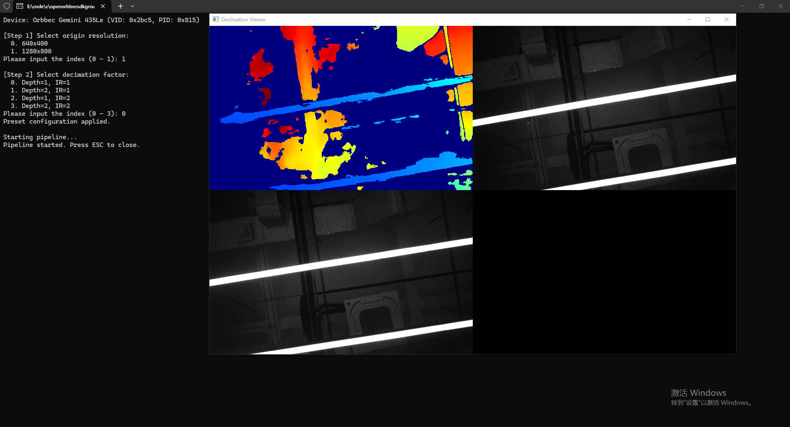

# C++ Sample: 1.stream.decimation

## Overview

This sample demonstrates how to configure device preset resolutions, select sensor decimation profiles, and display the resulting streams using the SDK.

### Knowledge

A `StreamProfile` describes the stream format, resolution, FPS, and decimation settings.
Some devices (e.g. Gemini 435LE) require a preset resolution configuration to be applied before streaming.

## Code overview

1. Check the device model. For specific devices (e.g., Gemini 435Le), you must configure the global preset resolution and decimation factor before selecting streams.

    ```cpp
        // List all available presets
        for(uint32_t index = 0; index < presetNum; index++) {
            auto presetConfig = presetList->getPresetResolutionRatioConfig(index);
            std::cout << " - " << index << ". width " << presetConfig.width << ", height " << presetConfig.height << ", IR decimation "
                    << presetConfig.irDecimationFactor << ", Depth decimation " << presetConfig.depthDecimationFactor << std::endl;
        }
        // Get User Selection
        uint32_t selected = getUserInput(presetNum);
        
        // Apply the configuration to the device
        auto presetConfig = presetList->getPresetResolutionRatioConfig(selected);
        device->setStructuredData(OB_STRUCT_PRESET_RESOLUTION_CONFIG, (uint8_t *)&presetConfig, sizeof(presetConfig));
        std::cout << "Preset configuration applied." << std::endl;
    ```

2. Obtain and print the detailed stream profile information. For sensors supporting decimation, it displays both the current downsampled resolution and the original resolution along with the decimation factor.

    ```cpp
        auto videoProfile = profile->as<ob::VideoStreamProfile>();
        if(!videoProfile)
            return;

        auto formatName       = profile->getFormat();
        auto width            = videoProfile->getWidth();
        auto height           = videoProfile->getHeight();
        auto fps              = videoProfile->getFps();
        auto decimationConfig = videoProfile->getDecimationConfig();

        std::cout << index << ". format: " << ob::TypeHelper::convertOBFormatTypeToString(formatName) << ", res: " << width << "*" << height << ", fps: " << fps;

        // If decimation (downsampling) is active, print origin details
        if(decimationConfig.factor != 0) {
            std::cout << ", originRes: " << decimationConfig.originWidth << "*" << decimationConfig.originHeight
                    << ", decimation factor: " << decimationConfig.factor;
        }
        std::cout << std::endl;
    ```

3. Select a stream profile and enable it in the pipeline configuration. For sensors supporting decimation, the decimation configuration can be obtained from the profile and applied to enable hardware downsampling.

    ```cpp
        // User selects a profile (Resolution/FPS)
        std::shared_ptr<ob::StreamProfile> profile = selectStreamProfile(sensor, sensorType);

        if(profile) {
            // Enable this specific stream profile in the pipeline configuration
            config->enableStream(profile);
            std::cout << " -> Stream enabled." << std::endl;

            // support 305 decimation configuration to stream profile enabling
            // auto videoProfile     = profile->as<ob::VideoStreamProfile>();
            // auto decimationConfig = videoProfile->getDecimationConfig();
            // config->enableVideoStream(sensorType, decimationConfig);
        }
    ```

## Run Sample

Follow the console prompts to input the index for preset resolution and stream profiles. 
Press the `Esc` key in the window to exit the program.

### Result


