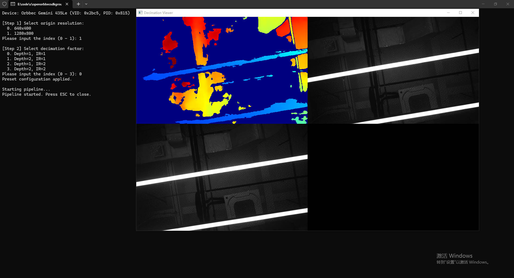

# C++ Sample: 1.stream.decimation

## Overview

This sample demonstrates how to configure hardware decimation on Orbbec devices. The user selects the origin resolution and decimation factors, and the SDK auto-selects format and FPS.

### Knowledge

Some devices (e.g. Gemini 435Le, Gemini 305) support hardware decimation, which downsamples the original sensor resolution to a smaller output resolution.
A `PresetResolutionConfig` defines the origin resolution and decimation factors for Depth and IR sensors.

## Code Overview

### Step 1: Select origin resolution

List unique origin resolutions deduplicated from all available preset configs.

```cpp
std::vector<OBPresetResolutionConfig> matchedPresets;
OBPresetResolutionConfig originPreset = selectOriginResolution(device, matchedPresets);
```

### Step 2: Select decimation factor

For the chosen resolution, show available decimation factors and let the user pick one. If only one option exists, it is auto-selected.

```cpp
OBPresetResolutionConfig presetConfig = selectDecimation(matchedPresets);
```

### Apply preset config

Apply the selected config to the device. Gemini 305 uses a different decimation mechanism, so this step is skipped for 305.

```cpp
if(!ob_smpl::isGemini305Device(vid, pid)) {
    device->setStructuredData(OB_STRUCT_PRESET_RESOLUTION_CONFIG, (uint8_t *)&presetConfig, sizeof(presetConfig));
}
```

### Enable streams

Format and FPS are auto-selected by the SDK (`OB_FORMAT_ANY` / `OB_FPS_ANY`).

- **Gemini 305** uses the decimation-config-based API:

```cpp
OBHardwareDecimationConfig decimationConfig{};
decimationConfig.originWidth  = originWidth;
decimationConfig.originHeight = originHeight;
decimationConfig.factor       = presetConfig.depthDecimationFactor;
config->enableVideoStream(OB_SENSOR_DEPTH, decimationConfig);
config->enableVideoStream(OB_SENSOR_IR_LEFT, decimationConfig);
config->enableVideoStream(OB_SENSOR_IR_RIGHT, decimationConfig);
```

- **Other devices** find the matching profile by resolution and enable it directly:

```cpp
auto profile = findProfile(depthSensor, originWidth, originHeight, presetConfig.depthDecimationFactor);
config->enableStream(profile);
```

The `findProfile` function handles two cases:
- Profiles with decimation (`factor > 0`): match by `decimationConfig.originWidth/originHeight`
- Profiles without decimation (`factor == 0`): match by output resolution `originWidth / decimationFactor`

## Run Sample

Follow the console prompts to complete the 2-step selection:

1. Select an origin resolution
2. Select decimation factors for Depth and IR

Press the `Esc` key in the window to exit the program.

### Result


