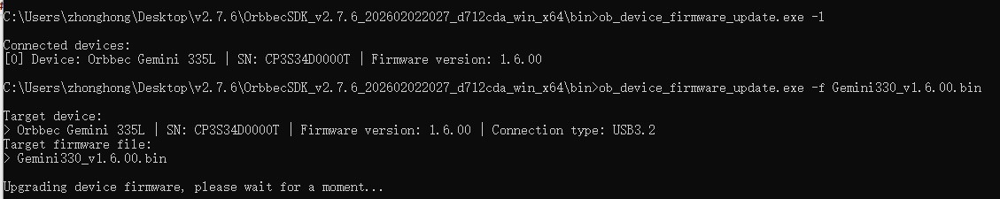
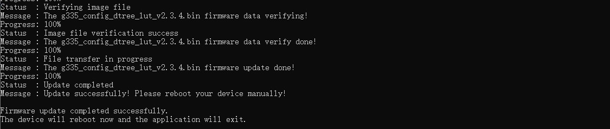
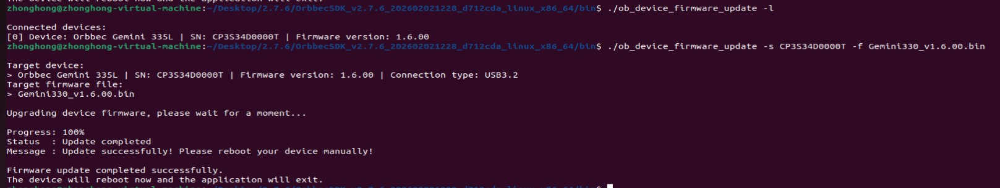

# C++ Sample：2.device.firmware_update

## Overview

This sample demonstrates how to use the SDK to update the firmware of a connected device. It provides a command-line interface to list devices, select a specific device by serial number, and perform a synchronous firmware update.

> Note: This sample is not suitable for Femto Mega, Femto Mega I, and Femto Bolt devices.
> For these devices, please refer to the this repository: [https://github.com/orbbec/OrbbecFirmware](https://github.com/orbbec/OrbbecFirmware)

Compared with earlier versions, this sample no longer uses hard-coded logic or interactive selection.
All operations are performed through command-line parameters.

### Knowledge

Context is the environment context, the first object created during initialization, which can be used to perform some settings, including but not limited to device status change callbacks, log level settings, etc. Context can access multiple devices.

Device is the device object, which can be used to obtain the device information, such as the model, serial number, and various sensors. One actual hardware device corresponds to one Device object.

## Code overview

1. Parse Command-Line Arguments
    This sample uses command-line arguments to control behavior.

    ```c++
    Supported arguments:
      -h, --help : Show help information
      -l, --list_devices : List all connected devices
      -f <path>, --file <path> : Firmware image file path
      -s <sn>, --serial_number <sn> : Target device serial number
    ```

    Arguments are parsed at program startup:

    ```c++
    CmdArgs args{};
    if(!parseArguments(argc, argv, args)) {
        return -1;
    }
    ```

2. Initialize the SDK Context: This is necessary to access the connected devices.

    ```c++
    std::shared_ptr<ob::Context> context = std::make_shared<ob::Context>();
    ```
    **Linux Backend Recommendation**

    On Linux, it is recommended to use LibUVC instead of V4L2 for firmware updates.
    This should be done before querying devices.

    ```c++
    #if defined(__linux__)
        context->setUvcBackendType(OB_UVC_BACKEND_TYPE_LIBUVC);
    #endif
    ```

3. Query and List Connected Devices.

    ```c++
    std::shared_ptr<ob::DeviceList> deviceList = context->queryDeviceList();
    uint32_t                        count      = deviceList->getCount();
    for(uint32_t i = 0; i < count; ++i) {
        try {
            devices.push_back(deviceList->getDevice(i));
        }
        catch(ob::Error &e) {
            std::cerr << "Failed to get device, ignoring it." << std::endl;
            std::cerr << "Error message: " << e.what() << std::endl;
        }
    }
    ```

    If -l or --list_devices is specified, the program will only list devices and then exit:

    ```c++
    if(args.listOnly) {
        printDeviceList(devices);
        return 0;
    }
    ```

4. Select Target Device

- If only one device is connected and -s is not specified, it will be selected automatically.
- If multiple devices are connected, -s <serial_number> is mandatory.
- If the specified serial number is not found, the program will exit with an error.

    ```c++
    if(args.serial.empty() && devices.size() > 1) {
        printDeviceList(devices);
        return -1;
    }
    ```

5. Define a Callback Function for Firmware Update Progress

    You can define a callback function to get the progress of the firmware update. The callback function will be called every time the device updates its progress.

    ```c++
    void firmwareUpdateCallback(OBFwUpdateState state, const char *message, uint8_t percent) {
        if(firstCall) {
            firstCall = !firstCall;
        }
        else {
            if(ansiEscapeSupported) {
                std::cout << "\033[3F";  // Move cursor up 3 lines
            }
        }

        if(ansiEscapeSupported) {
            std::cout << "\033[K";  // Clear the current line
        }
        std::cout << "Progress: " << static_cast<uint32_t>(percent) << "%" << std::endl;

        if(ansiEscapeSupported) {
            std::cout << "\033[K";
        }
        std::cout << "Status  : ";
        switch(state) {
        case STAT_VERIFY_SUCCESS:
            std::cout << "Image file verification success" << std::endl;
            break;
        case STAT_FILE_TRANSFER:
            std::cout << "File transfer in progress" << std::endl;
            break;
        case STAT_DONE:
            std::cout << "Update completed" << std::endl;
            break;
        case STAT_DONE_REBOOT_AND_REUPDATE:
            needReupdate = true;
            std::cout << "Update completed" << std::endl;
            break;
        case STAT_IN_PROGRESS:
            std::cout << "Upgrade in progress" << std::endl;
            break;
        case STAT_START:
            std::cout << "Starting the upgrade" << std::endl;
            break;
        case STAT_VERIFY_IMAGE:
            std::cout << "Verifying image file" << std::endl;
            break;
        default:
            std::cout << "Unknown status or error" << std::endl;
            break;
        }

        if(ansiEscapeSupported) {
            std::cout << "\033[K";
        }
        std::cout << "Message : " << message << std::endl << std::flush;
    }
    ```

6. Perform Firmware Update

    Firmware update is performed synchronously:

    ```c++
        devices[deviceIndex]->updateFirmware(firmwarePath.c_str(), firmwareUpdateCallback, false);
    ```

7. Reboot and Second Update (If Required)

    Some devices require two-stage firmware updates.
    If the callback reports STAT_DONE_REBOOT_AND_REUPDATE:
    - The device will reboot automatically
    - The program waits for the device to reconnect
    - The firmware update is performed again on the reconnected device

    This logic is handled internally by the sample and requires no user intervention unless the device does not reconnect in time.

8. Final Reboot

    After the firmware update completes successfully, the device will reboot:

    ```c++
    targetDevice->reboot();
    ```

### Attention

1. Do not disconnect the device during the firmware update process.
2. If multiple devices are connected, always specify the serial number using -s.
3. On Linux platforms, using LibUVC is strongly recommended.
4. Firmware update failures will throw exceptions—check console output for details.

## Run Sample

- Build the firmware update sample, please refer [compile documents](https://orbbec.github.io/docs/OrbbecSDKv2_API_User_Guide/source/2_QuickStarts/QuickStarts.html#quickstarts).The following instructions use the SDK package (.zip) as an example.

    **Linux**: Download Linux x64/ARM64 [Orbbec SDK v2 zip package](https://github.com/orbbec/OrbbecSDK_v2/releases) and run setup.sh in the root directory to compile the sample. The executable will be in the bin folder.

    **Windows**: Download windows [Orbbec SDK v2 zip package](https://github.com/orbbec/OrbbecSDK_v2/releases) and the sample is precompiled and located in the bin folder. 

- Next, navigate to the bin folder in the root directory.


### Windows 

1. List Connected Devices

    ```
    ob_device_firmware_update.exe -l
    ```

2. Update Firmware (Single Device Connected)
    ```
    // Gemini330_v1.6.00.bin: firmware image file path(can be an absolute or relative path)
    ob_device_firmware_update.exe -f Gemini330_v1.6.00.bin
    ```

3. Update Firmware (Multiple Devices Connected)
    
    ```
    // CP3S34D0000T: target device serial number (SN)
    // Gemini330_v1.6.00.bin: firmware image file path(can be an absolute or relative path)
    ob_device_firmware_update.exe -s CP3S34D0000T -f Gemini330_v1.6.00.bin
    ```

- windows update result





### Linux 

1. List Connected Devices

    ```
    ob_device_firmware_update -l
    ```

2. Update Firmware (Single Device Connected)
    ```
    // Gemini330_v1.6.00.bin: firmware image file path(can be an absolute or relative path)
    ob_device_firmware_update -f Gemini330_v1.6.00.bin
    ```

3. Update Firmware (Multiple Devices Connected)
    
    ```
    // CP3S34D0000T: target device serial number (SN)
    // Gemini330_v1.6.00.bin: firmware image file path(can be an absolute or relative path)
    ob_device_firmware_update -s CP3S34D0000T -f Gemini330_v1.6.00.bin
    ```

- linux update Result




