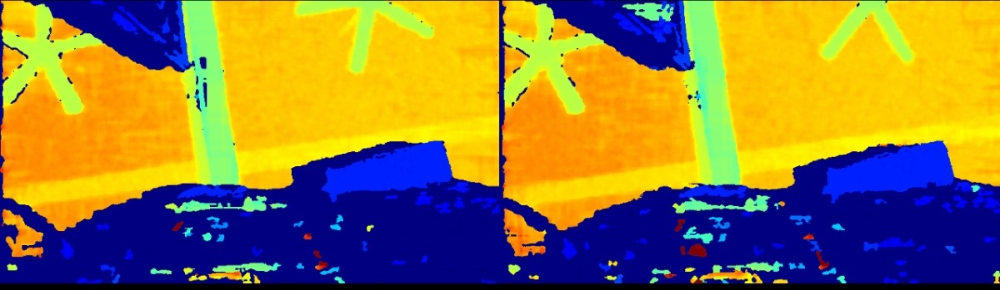

# C++ Sample: 3.advanced.hdr

## Overview

In this sample, user can get the HDR merge image. Also allows the user to control the on-off of the HDR synthesis and whether the original image is displayed through the keyboard.

### Knowledge

Pipeline is a pipeline for processing data streams, providing multi-channel stream configuration, switching, and frame aggregation functions.

Frameset is a combination of different types of Frames.

### Attentions

> This Sample supports devices with Frame Interleave HDR mode or OB_STRUCT_DEPTH_HDR_CONFIG property.

## Code overview

### 1. Configure streams and create HDRMerge filter

Enable depth and infrared streams, and create the HDRMerge post-processing filter.

```cpp
std::shared_ptr<ob::Config> config = std::make_shared<ob::Config>();
config->enableVideoStream(OB_STREAM_DEPTH);
config->enableVideoStream(OB_STREAM_IR_LEFT);
config->enableVideoStream(OB_STREAM_IR_RIGHT);
config->setFrameAggregateOutputMode(OB_FRAME_AGGREGATE_OUTPUT_ALL_TYPE_FRAME_REQUIRE);

auto hdrMerge = ob::FilterFactory::createFilter("HDRMerge");
```

### 2. Enable HDR mode

The sample supports two HDR modes, checked in the following order:

**Mode A — Frame Interleave**

```cpp
if(device->isFrameInterleaveSupported()) {
    device->loadFrameInterleave("Depth from HDR");
    device->setBoolProperty(OB_PROP_FRAME_INTERLEAVE_ENABLE_BOOL, true);
}
```

**Mode B — HdrConfig**

```cpp
else if(device->isPropertySupported(OB_STRUCT_DEPTH_HDR_CONFIG, OB_PERMISSION_READ_WRITE)) {
    OBHdrConfig obHdrConfig;
    obHdrConfig.enable     = true;
    obHdrConfig.exposure_1 = 7500;
    obHdrConfig.gain_1     = 24;
    obHdrConfig.exposure_2 = 100;
    obHdrConfig.gain_2     = 16;
    device->setStructuredData(OB_STRUCT_DEPTH_HDR_CONFIG, reinterpret_cast<uint8_t *>(&obHdrConfig), sizeof(OBHdrConfig));
}
```

**Unsupported device**

```cpp
else {
    std::cerr << "Current default device does not support HDR merge" << std::endl;
    return -1;
}
```

### 3. Process frames

Wait for a frameset, optionally display raw frames grouped by HDR sequence ID, and apply HDRMerge to produce the merged depth frame.

```cpp
auto frameSet = pipe.waitForFrameset(100);
if(frameSet == nullptr) {
    continue;
}

auto depthFrame   = frameSet->getFrame(OB_FRAME_DEPTH)->as<ob::DepthFrame>();
auto leftIRFrame  = frameSet->getFrame(OB_FRAME_IR_LEFT)->as<ob::IRFrame>();
auto rightIRFrame = frameSet->getFrame(OB_FRAME_IR_RIGHT)->as<ob::IRFrame>();

int groupId = static_cast<int>(depthFrame->getMetadataValue(OB_FRAME_METADATA_TYPE_HDR_SEQUENCE_INDEX));
win.pushFramesToView({ depthFrame, leftIRFrame, rightIRFrame }, groupId);

auto result      = hdrMerge->process(frameSet);
auto resultFrameSet   = result->as<ob::FrameSet>();
auto resultDepthFrame = resultFrameSet->getFrame(OB_FRAME_DEPTH)->as<ob::DepthFrame>();
win.pushFramesToView(resultDepthFrame, 10);
```

### 4. Stop the pipeline and disable HDR

**Frame Interleave mode**

```cpp
device->setBoolProperty(OB_PROP_FRAME_INTERLEAVE_ENABLE_BOOL, false);
```

**HdrConfig mode**

```cpp
OBHdrConfig obHdrConfig = { 0 };
obHdrConfig.enable      = false;
device->setStructuredData(OB_STRUCT_DEPTH_HDR_CONFIG, reinterpret_cast<uint8_t *>(&obHdrConfig), sizeof(OBHdrConfig));
```

## Run Sample

### Key introduction

Press the 'Esc' key in the window to exit the program.
Press the '?' key in the window to show key map.
Press the 'M' key in the window to Toggle HDR merge.
Press the 'N' key in the window to Toggle alternate show origin frame.

### Result


