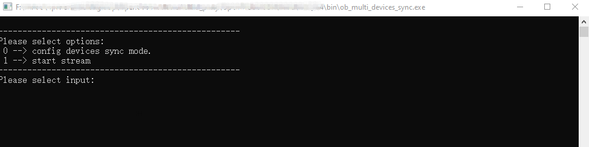
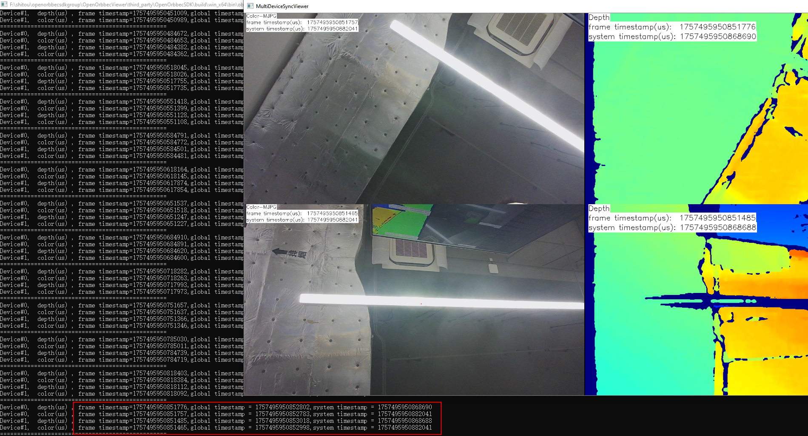
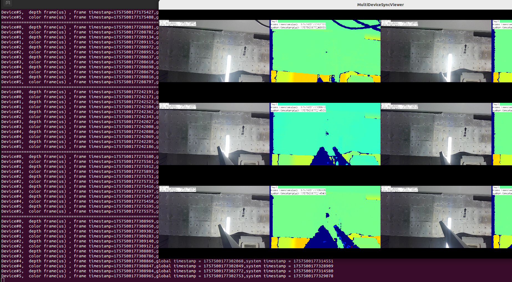

# C++ Sample: 3.advanced.multi_devices_sync

## Overview

Function description: Demonstrate multi devices synchronization operation,This sample supports network devices, USB devices, and GMSL devices (such as Gemini 335lg). 

- Network devices and USB devices must be connected to a sync hub(via the 8-pin port),please refer to the [Multi-device Sync documentation](https://www.orbbec.com/docs-general/set-up-cameras-for-external-synchronization_v1-2/).
- GMSL devices can connect via the 8-pin port or through multi-device sync via GMSL2 /FAKRA, Gemini 335lg multi device sync please refer [this document](https://www.orbbec.com/docs/gemini-335lg-hardware-synchronization/).


## Code overview

### 1.Configure multi device synchronization

```cpp
    configMultiDeviceSync();
```

### 2.Conduct multi device testing
```cpp
    testMultiDeviceSync();
```
#### 2.1 Distinguishing secondary devices

```cpp
        streamDevList.clear();
        // Query the list of connected devices
        auto devList  = context.queryDeviceList();
        int  devCount = devList->deviceCount();
        for(int i = 0; i < devCount; i++) {
            streamDevList.push_back(devList->getDevice(i));
        }

        if(streamDevList.empty()) {
            std::cerr << "Device list is empty. please check device connection state" << std::endl;
            return -1;
        }

        // traverse the device list and create the device
        std::vector<std::shared_ptr<ob::Device>> primary_devices;
        std::vector<std::shared_ptr<ob::Device>> secondary_devices;
        for(auto dev: streamDevList) {
            auto config = dev->getMultiDeviceSyncConfig();
            if(config.syncMode == OB_MULTI_DEVICE_SYNC_MODE_PRIMARY) {
                primary_devices.push_back(dev);
            }
            else {
                secondary_devices.push_back(dev);
            }
        }
```

#### 2.2 Enable secondary devices

```cpp
        std::cout << "Secondary devices start..." << std::endl;
        startDeviceStreams(secondary_devices, 0);
```

#### 2.3 Enable Primary device


```cpp
        std::cout << "Primary device start..." << std::endl;
        startDeviceStreams(primary_devices, static_cast<int>(secondary_devices.size()));
```

#### 2.4 Set software synchronization interval time

```cpp
    // Start the multi-device time synchronization function
    context.enableDeviceClockSync(60000);  
```

#### 2.5 Create a FramePairingManager object for multi-device timestamp pairing
``` cpp
        auto framePairingManager = std::make_shared<FramePairingManager>();
        framePairingManager->setPipelineHolderList(pipelineHolderList);
```

#### 2.6 Pair multiple devices based on timestamps
```cpp
        std::vector<std::pair<std::shared_ptr<ob::Frame>, std::shared_ptr<ob::Frame>>> framePairs = framePairingManager->getFramePairs();
        if(framePairs.size() == 0) {
            continue;
        }
```

#### 7.Close data stream

```cpp
        // Stop streams and clear resources
        for(auto &holder: pipelineHolderList) {
            holder->stopStream();
        }
        pipelineHolderList.clear();
```

#### 8.Software Triggering Mode


Set the device synchronization mode to `OB_MULTI_DEVICE_SYNC_MODE_SOFTWARE_TRIGGERING` after opening the stream, and the device will wait for the trigger signal (command) sent by the upper layer after opening the stream. The number of frames to be triggered for triggering mode can be configured through `framesPerTrigger`. The method for triggering images:

```c++
auto multiDeviceSyncConfig = dev->getMultiDeviceSyncConfig();
if(multiDeviceSyncConfig.syncMode == OB_MULTI_DEVICE_SYNC_MODE_SOFTWARE_TRIGGERING)
{
    dev->triggerCapture();
}
```

*Press `t` in the render window to trigger a capture once.*

## Configuration file parameter description
**Notes："The configuration parameters for multi-device Sync may vary between different devices. Please refer to the [Multi-device Sync documentation](https://www.orbbec.com/docs-general/set-up-cameras-for-external-synchronization_v1-2/)**

config file :  MultiDeviceSyncConfig.json

```
{
    "version": "1.0.0",
    "configTime": "2023/01/01",
    "devices": [
        {
            "sn": "CP2194200060", //device serial number
            "syncConfig": {
                "syncMode": "OB_MULTI_DEVICE_SYNC_MODE_PRIMARY",     // sync mode
                "depthDelayUs": 0,                                   //Configure depth trigger delay, unit: microseconds
                "colorDelayUs": 0,                                   //Configure color trigger delay, unit: microseconds
                "trigger2ImageDelayUs": 0,                           //Configure trigger image delay, unit: microseconds
                "triggerOutEnable": true,                            //Configure trigger signal output enable.
                "triggerOutDelayUs": 0,                              //Configure trigger signal output delay, unit: microsecond
                "framesPerTrigger": 1                                //Configure the number of frames captured by each trigger in the trigger mode
            }
        },
        {
            "sn": "CP0Y8420004K",
            "syncConfig": {
                "syncMode": "OB_MULTI_DEVICE_SYNC_MODE_SECONDARY",
                "depthDelayUs": 0,
                "colorDelayUs": 0,
                "trigger2ImageDelayUs": 0,
                "triggerOutEnable": true,
                "triggerOutDelayUs": 0,
                "framesPerTrigger": 1
            }
        }
    ]
}
```
**There are three synchronization configuration methods for network devices and USB devices.**

- The first method is to set one device as OB_MULTI_DEVICE_SYNC_MODE_PRIMARY, and configure the other devices as OB_MULTI_DEVICE_SYNC_MODE_SECONDARY. 
- The second method is to set one device as OB_MULTI_DEVICE_SYNC_MODE_SOFTWARE_TRIGGERING, and configure the other devices as OB_MULTI_DEVICE_SYNC_MODE_HARDWARE_TRIGGERING,Capture images by send a software trigger command(`dev->triggerCapture()`).
- The third method is to set all devices as OB_MULTI_DEVICE_SYNC_MODE_SECONDARY, in this mode, an external trigger signal is required.

**For GMSL devices, please refer to the following document.**


## GMSL Multi devices Sync

###  Method 1:Multi-device sync via 8-pin port
When using 8-pin port for multi-device synchronization, in order to ensure the quality of the synchronization signal, it is necessary to use it together with a multi-device sync hub,please refer [Multi-device Sync documentation](https://www.orbbec.com/docs-general/set-up-cameras-for-external-synchronization_v1-2/).

via 8-pin port, GMSL multi devices sync is the same as that for USB devices, and the supported synchronization modes are also the same.

### Method 2: Multi-device sync via GMSL2/FAKRA

GMSL Multi devices Sync please refer [this document](https://www.orbbec.com/docs/gemini-335lg-hardware-synchronization/),There are two usage methods:

The first is to set all devices as OB_MULTI_DEVICE_SYNC_MODE_SECONDARY mode and synchronize them through PWM triggering. 

The second is to set all devices as OB_MULTI_DEVICE_SYNC_MODE_HARDWARE_TRIGGERING mode and synchronize them through PWM triggering. 


PWM triggering please refer ob_multi_devices_sync_gmsltrigger sample.

* Notes: To make the multi devices sync sample simple and versatile, the PWM trigger has been separated into its own sample. GMSL2/FAKRA requires running two samples for testing. If you are developing your own application, you can combine these two functionalities into a single application.


## Run Sample

### windows 
The following demonstrates how to use the multi-device synchronization sample on Windows with the Gemini 335L.
- Double-click ob_multi_devices_sync.exe, and the following dialog will appear,Then select 0.




0: Configure sync mode and start stream

1: Start stream: If the parameters for multi device sync mode have been configured, you can start the stream directly.


- Multi-device synchronization test results are as follows



Observe the timestamps. As shown in the figure below, the device timestamps of the two devices are identical, indicating that the two devices are successfully synchronized.
### Linux/ARM64

- For USB device or Ethernet device multi-device synchronization, simply execute ob_multi_devices_sync. 
```
$ ./ob_multi_devices_sync
```
**Notes:**

**Multi-device sync via 8-pin port, GMSL multi devices sync is the same as that for USB devices, and the supported synchronization modes are also the same.**


- For GMSL device multi-device sync via GMSL2/FAKRA, run the sample according to the following steps

**1. Open the first terminal and run the multi-devices sync sample**

```
$ ./ob_multi_devices_sync

--------------------------------------------------
Please select options: 
 0 --> config devices sync mode. 
 1 --> start stream 
--------------------------------------------------
Please select input: 0
```


**2. Open the second terminal and run the sample that sends PWM trigger signals with administrator privileges**

```
orbbec@agx:~/SensorSDK/build/install/Example/bin$ sudo ./ob_multi_devices_sync_gmsltrigger
Please select options: 
------------------------------------------------------------
 0 --> config GMSL SOC hardware trigger Source. Set trigger fps: 
 1 --> start Trigger 
 2 --> stop Trigger 
 3 --> exit 
------------------------------------------------------------
input select item: 0

Enter FPS (frames per second) (for example: 3000): 3000
Setting FPS to 3000...
Please select options: 
------------------------------------------------------------
 0 --> config GMSL SOC hardware trigger Source. Set trigger fps: 
 1 --> start Trigger 
 2 --> stop Trigger 
 3 --> exit 
------------------------------------------------------------
input select item: 1

```

**Notes:**
- Enter FPS (frames per second) (for example: 3000): 3000(3000 indicates 30 fps) .
The differences between the two sync modes are as follows:

 - OB_MULTI_DEVICE_SYNC_MODE_SECONDARY Mode: Sets the device to secondary mode. In this mode, the PWM trigger frame rate must match the actual streaming frame rate. For example, if the streaming frame rate is 30 fps, the PWM frame rate must also be set to 30

 - OB_MULTI_DEVICE_SYNC_MODE_HARDWARE_TRIGGERING mode: Sets the device to hardware triggering mode. In this mode, the PWM trigger signal must not exceed half of the streaming frame rate. For example, if the streaming frame rate is set to 30 fps, and the PWM trigger signal exceeds 15, the camera will still only capture images at 15 fps. In other words, when the streaming frame rate is 30 fps, the valid range for the PWM trigger signal is 1 to 15 fps.

 

#### Test Results
 The multi-device synchronization results of six Gemini 335Lg on AGX Orin are as follows:


