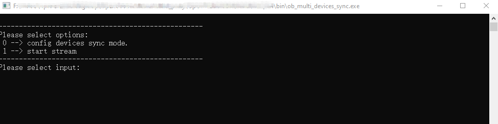
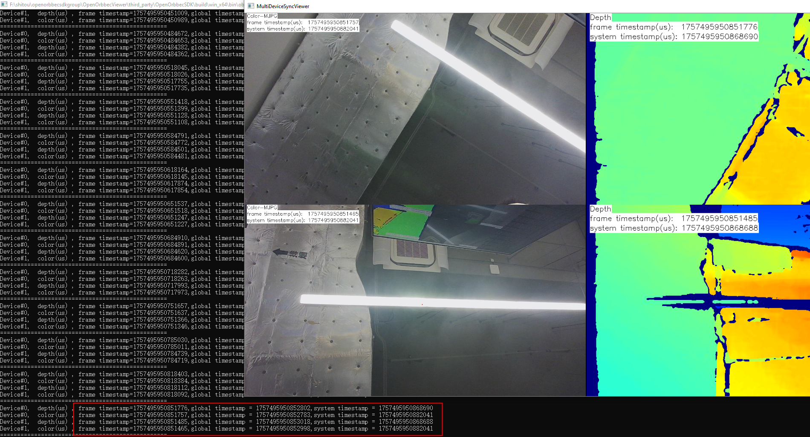
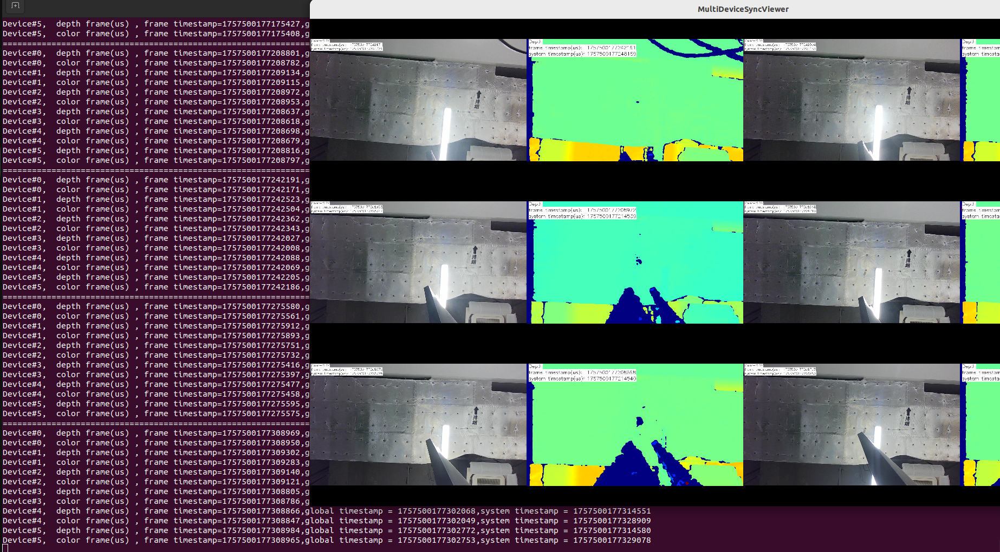

# C++ Sample: 3.advanced.multi_devices_sync

## Overview

This sample demonstrates multi-device synchronization. It supports network devices, USB devices, and GMSL devices (such as Gemini 335Lg).

- Network and USB devices must be connected to a sync hub (via the 8-pin port). Please refer to the [Multi-device Sync documentation](https://www.orbbec.com/docs-general/set-up-cameras-for-external-synchronization_v1-2/).
- GMSL devices can connect via the 8-pin port or synchronize via GMSL2/FAKRA. For Gemini 335Lg multi-device sync, please refer to [this document](https://www.orbbec.com/docs/gemini-335lg-hardware-synchronization/).

## Code Overview

### 1. Load the sync configuration

The sample reads `./MultiDeviceSyncConfig.json` from the current working directory and applies the sync config to each matched device:

```cpp
    loadConfigFile();
    configMultiDeviceSync();  // device->setMultiDeviceSyncConfig(config->syncConfig);
```

### 2. Conduct multi-device testing

```cpp
    testMultiDeviceSync(headless);
```

#### 2.1 Distinguishing secondary devices

```cpp
        // Query the list of connected devices
        auto devList  = context.queryDeviceList();
        int  devCount = devList->deviceCount();
        for(int i = 0; i < devCount; i++) {
            streamDevList.push_back(devList->getDevice(i));
        }

        // Traverse the device list, start secondary devices first, then the primary device
        std::vector<std::shared_ptr<ob::Device>> primary_devices;
        std::vector<std::shared_ptr<ob::Device>> secondary_devices;
        for(auto dev: streamDevList) {
            auto config = dev->getMultiDeviceSyncConfig();
            if(config.syncMode == OB_MULTI_DEVICE_SYNC_MODE_PRIMARY) {
                primary_devices.push_back(dev);
            }
            else {
                secondary_devices.push_back(dev);
            }
        }
```

#### 2.2 Enable secondary devices, then the primary device

```cpp
        startDeviceStreams(secondary_devices, 0);
        startDeviceStreams(primary_devices, static_cast<int>(secondary_devices.size()));
```

#### 2.3 Start the multi-device time synchronization function

```cpp
        for(const auto &device: streamDevList) {
            try {
                device->timerSyncWithHost();
            }
            catch(const ob::Error &e) {
                std::cerr << "Sync device clock failed: " << e.what() << std::endl;
            }
        }
```

#### 2.4 Software Triggering Mode

Set the device synchronization mode to `OB_MULTI_DEVICE_SYNC_MODE_SOFTWARE_TRIGGERING`; after the stream is opened, the device waits for the trigger command from the host. The number of frames captured per trigger is configured through `framesPerTrigger`. The method for triggering images:

```cpp
auto multiDeviceSyncConfig = dev->getMultiDeviceSyncConfig();
if(multiDeviceSyncConfig.syncMode == OB_MULTI_DEVICE_SYNC_MODE_SOFTWARE_TRIGGERING)
{
    dev->triggerCapture();
}
```

*Press `T` in the preview window to trigger a capture once; press `S` to sync device clocks.*

## Configuration File Parameter Description

> **Note:** The configuration parameters for multi-device sync may vary between devices. Please refer to the [Multi-device Sync documentation](https://www.orbbec.com/docs-general/set-up-cameras-for-external-synchronization_v1-2/).

```json
{
    "heartbeatEnable": false,
    "devices": [
        {
            "sn": "CP2194200060",
            "syncConfig": {
                "syncMode": "OB_MULTI_DEVICE_SYNC_MODE_PRIMARY",
                "depthDelayUs": 0,
                "colorDelayUs": 0,
                "trigger2ImageDelayUs": 0,
                "triggerOutEnable": true,
                "triggerOutDelayUs": 0,
                "framesPerTrigger": 1
            },
            "streamConfig": {
                "depth": {
                    "width": 640,
                    "height": 480,
                    "fps": 30,
                    "format": "OB_FORMAT_Y16"
                },
                "color": {
                    "width": 640,
                    "height": 480,
                    "fps": 30,
                    "format": "OB_FORMAT_MJPG"
                }
            }
        }
    ]
}
```

**Field descriptions:**

| Field | Type | Required | Description |
| ----- | ---- | -------- | ----------- |
| `heartbeatEnable` | bool | No | Global toggle applied to every device via `device->enableHeartbeat()`; default `false` |
| `sn` | string | Yes | Device serial number, used to match connected devices. Can be found using the OrbbecViewer tool or in the program log after connecting devices |
| `syncConfig.syncMode` | string | Yes | Sync mode, see table below for available values |
| `syncConfig.depthDelayUs` | int | Yes | IR/Depth/ToF trigger signal input delay (microseconds). Default 0; see the series-specific sync documentation for recommended per-device delay values |
| `syncConfig.colorDelayUs` | int | Yes | RGB trigger signal input delay (microseconds), typically 0 |
| `syncConfig.trigger2ImageDelayUs` | int | Yes | Delay from trigger signal input to image capture (microseconds), typically 0 |
| `syncConfig.triggerOutEnable` | bool | Yes | Device trigger signal output enable switch. With a star hub: enable on the primary device only. With a daisy-chain hub: enable on the primary and all secondary devices. Forcibly set to true in PRIMARY mode |
| `syncConfig.triggerOutDelayUs` | int | Yes | Device trigger signal output delay (microseconds), typically 0 |
| `syncConfig.framesPerTrigger` | int | Yes | Number of frames captured per trigger, only effective in software and hardware trigger modes |
| `streamConfig` | object | No | Stream profile overrides; omit the whole section to use the SDK default profile |
| `streamConfig.depth` / `streamConfig.color` | object | No | Per-sensor profile request. Each field is optional: `width`, `height`, `fps` (0 = not specified), `format` (empty = not specified, e.g. `"OB_FORMAT_Y16"`, `"OB_FORMAT_MJPG"`). Unspecified fields match any value; stream start fails if the device has no matching profile |

> **Note:** All devices must be configured with the same frame rate for each stream type. Multi-device frame grouping and pairing rely on a consistent frame interval; mixing frame rates across devices will lead to inaccurate synchronization and analysis results.

**`syncMode` available values:**

| Mode | Description |
| ---- | ----------- |
| `OB_MULTI_DEVICE_SYNC_MODE_PRIMARY` | Primary mode, outputs sync trigger signal |
| `OB_MULTI_DEVICE_SYNC_MODE_SECONDARY` | Secondary mode, receives trigger signal |
| `OB_MULTI_DEVICE_SYNC_MODE_SOFTWARE_TRIGGERING` | Software trigger mode, PC controls capture timing |
| `OB_MULTI_DEVICE_SYNC_MODE_HARDWARE_TRIGGERING` | Hardware trigger mode, triggered by external hardware signal |
| `OB_MULTI_DEVICE_SYNC_MODE_SECONDARY_SYNCED` | Secondary synced variant, starts capturing immediately, auto-aligns when trigger signal is received |

**There are three common synchronization configuration methods for network devices and USB devices.**

- Method 1: set one device as `OB_MULTI_DEVICE_SYNC_MODE_PRIMARY`, and configure the other devices as `OB_MULTI_DEVICE_SYNC_MODE_SECONDARY`.
- Method 2: set one device as `OB_MULTI_DEVICE_SYNC_MODE_SOFTWARE_TRIGGERING`, and configure the other devices as `OB_MULTI_DEVICE_SYNC_MODE_HARDWARE_TRIGGERING`; capture images by sending a software trigger command (`dev->triggerCapture()`).
- Method 3: set all devices as `OB_MULTI_DEVICE_SYNC_MODE_SECONDARY`; in this mode, an external trigger signal is required.

## Run the Sample

On startup, the sample prints a menu:

- Enter `0`: Configure device sync mode and start streaming
- Enter `1`: Start streaming directly (use when devices are already configured)

**Keyboard shortcuts (preview window):**

| Key | Function |
| --- | -------- |
| `S` | Sync device clocks |
| `T` | Software trigger capture |
| `ESC` | Stop streaming and exit |

**Headless mode:** run without the OpenCV preview window, suitable for remote sessions (SSH) or headless servers:

```bash
./ob_multi_devices_sync --headless
```

Timestamp recording and sync monitor output run exactly as in normal mode. Press `Ctrl+C` to stop: the program catches SIGINT, flushes all CSV data, and shuts down streams before exiting.

### Windows

The following demonstrates how to use the multi-device synchronization sample on Windows with the Gemini 335L.

- Double-click `ob_multi_devices_sync.exe`. The following menu will appear; select `0`.



- Multi-device synchronization test results are as follows:



Observe the timestamps. As shown in the figure, the timestamps of the two devices are identical, indicating that the two devices are successfully synchronized.

### Linux / ARM64

- For USB or Ethernet device multi-device synchronization, simply execute `ob_multi_devices_sync`:

```bash
$ ./ob_multi_devices_sync
```

## GMSL Multi-device Sync

### Method 1: Multi-device sync via 8-pin port

When using the 8-pin port for multi-device synchronization, in order to ensure the quality of the synchronization signal, it is necessary to use it together with a multi-device sync hub. Please refer to the [Multi-device Sync documentation](https://www.orbbec.com/docs-general/set-up-cameras-for-external-synchronization_v1-2/).

Via the 8-pin port, GMSL multi-device sync is the same as that for USB devices, and the supported synchronization modes are also the same.

### Method 2: Multi-device sync via GMSL2/FAKRA

GMSL multi-device sync via GMSL2/FAKRA is driven by a PWM trigger signal; please refer to [this document](https://www.orbbec.com/docs/gemini-335lg-hardware-synchronization/). There are two usage methods:

- The first is to set all devices as `OB_MULTI_DEVICE_SYNC_MODE_SECONDARY` mode and synchronize them through PWM triggering.
- The second is to set all devices as `OB_MULTI_DEVICE_SYNC_MODE_HARDWARE_TRIGGERING` mode and synchronize them through PWM triggering.

PWM triggering requires the `ob_multi_devices_sync_gmsltrigger` sample (run both samples at the same time):

1. Open the first terminal and run this sample (`./ob_multi_devices_sync`, enter `0` to configure the sync mode and start streaming).
2. Open the second terminal and run the trigger sample with administrator privileges:

```bash
$ sudo ./ob_multi_devices_sync_gmsltrigger
------------------------------------------------------------
Please select options:
 0 --> config GMSL SOC hardware trigger Source. Set trigger fps:
 1 --> start Trigger
 2 --> stop Trigger
 3 --> exit
------------------------------------------------------------
input select item: 0

Enter FPS (frames per second) (for example: 3000): 3000
```

**Recommended startup order (applies to `HARDWARE_TRIGGERING` and `SECONDARY_SYNCED` modes):** start the streams first, then enable the trigger signal.

The differences between the two sync modes:

- `OB_MULTI_DEVICE_SYNC_MODE_SECONDARY` mode: the PWM trigger frame rate must match the actual streaming frame rate. For example, if the streaming frame rate is 30 fps, the PWM frame rate must also be set to 30.
- `OB_MULTI_DEVICE_SYNC_MODE_HARDWARE_TRIGGERING` mode: the PWM trigger signal must not exceed half of the streaming frame rate. For example, if the streaming frame rate is 30 fps, the valid range for the PWM trigger signal is 1 to 15 fps.

> **Notes:** To keep this sample simple and versatile, the PWM trigger has been separated into its own sample (`3.advanced.multi_devices_sync_gmsltrigger`). GMSL2/FAKRA requires running two samples for testing. If you are developing your own application, you can combine these two functionalities into a single application. When exiting the trigger sample, select `3` to ensure the `/dev/camsync` device is properly closed.

#### Test Results

The multi-device synchronization results of six Gemini 335Lg devices on AGX Orin are as follows:



## Timestamp CSV Output

During streaming, each device and each sensor (depth/color) records its own timestamp CSV file under `./output/`:

```text
output/
  sync_depth_dev0_<SN>.csv
  sync_color_dev0_<SN>.csv
  sync_depth_dev1_<SN>.csv
  sync_color_dev1_<SN>.csv
  ...
```

Each file contains one row per captured frame:

| Field | Description |
| ----- | ----------- |
| `row_id` | Sequential row index |
| `sw_frame_num` | Software frame number from the SDK |
| `hw_frame_num` | Hardware frame number; `-1` when the device does not support it |
| `system_ts_us` | Host system timestamp (microseconds) |
| `device_ts_us` | Device-side timestamp (microseconds) |
| `global_ts_us` | Global timestamp on the host clock domain (microseconds); `0` when unsupported |

> **Note:** Some devices do not provide a global timestamp (`global_ts_us` is all `0`) or a hardware frame number (`hw_frame_num` is `-1`). This is normal and expected.

## Sync Accuracy Analysis (Python)

A standalone Python script evaluates synchronization accuracy from the recorded CSV files. It performs both **multi-device** checks (cross-device timestamp alignment) and **intra-device** checks (depth-color pairing offset and frame-drop detection):

- **Script:** `scripts/analyze_sync.py` (also installed to the `bin/` directory together with the executable)
- **No third-party dependencies** (Python standard library only)

Run it from the directory containing the CSV files (typically `output/`):

```bash
cd bin/output
python ../analyze_sync.py
```

Or analyze any folder:

```bash
python analyze_sync.py /path/to/csv_dir [options]
```

**Options:**

| Option | Default | Description |
| ------ | ------- | ----------- |
| `[csv_dir]` | current directory | Directory with the `sync_*.csv` files |
| `--fps` | auto | Frame rate used to compute the grouping tolerance (half-frame interval); auto-detects from the median frame interval, falls back to `30` when there is too little data |
| `--threshold` | `5000` | In-group timestamp range (us) above which a matched group is flagged abnormal |
| `--ts-source` | `auto` | Time base for matching: `global` / `device` / `auto` (`auto` = global when valid, otherwise degrades to device) |
| `--frame-num-source` | `auto` | Frame number used for drop detection: `hw` / `sw` / `auto` (`auto` = hw when valid, otherwise degrades to sw) |
| `--output` | `<csv_dir>` | Base output directory; writes `analysis_multi_device/` and `analysis_per_device/` under it |

**Time base selection:**

- `global` (recommended): uses `global_ts_us`, all devices share the host clock domain.
- `device`: uses `device_ts_us`, for devices that do not support a global timestamp. The script prints a RISK note: without clock sync during capture, cross-device diffs include clock offset/drift and are indicative only.
- `auto`: uses `global` when valid; otherwise degrades to `device` with a note.

**Report sections:**

1. **Multi-device** (per sensor, requires >= 2 devices): matched-group completeness, abnormal in-group timestamp range, and per-group matched CSV.
2. **Intra-device** (per device): depth-color pairing count, global/device timestamp diff range, and per-stream dropped-frame counts (detailed drop positions go to `per_device_drops.csv`).

**Output files and field reference:**

| File | Location | Description |
| ---- | -------- | ----------- |
| `sync_matched_<sensor>.csv` | `analysis_multi_device/` | One row per matched moment: group id, `diffGlobalUs`/`diffDeviceUs` (max-min across devices; empty when that time base is invalid), and each device's frame numbers and timestamps |
| `sync_failed_<sensor>.csv` | `analysis_multi_device/` | One row per unmatched frame (anchor that found no partner within tolerance, or a frame skipped during a match); the frame itself was captured and is present in the original CSV, with full original columns: `sn, rowId, swNum, hwNum, systemUs, deviceUs, globalUs` |
| `per_device_dev<N>_<SN>.csv` | `analysis_per_device/` | One row per depth-color pair of device N: `diffGlobalUs`/`diffDeviceUs` and both frames' numbers and timestamps |
| `per_device_drops.csv` | `analysis_per_device/` | One row per detected dropped frame: `sn, sensor, frameNumSource, missingFrameNum` |

CSV column meanings:

`sync_matched_<sensor>.csv`:

| Column | Description |
| ------ | ----------- |
| `groupId` | Sequential index of the matched group |
| `diffGlobalUs` | Max-min spread of `global_ts_us` across the devices in the group; empty when the global time base is invalid |
| `diffDeviceUs` | Max-min spread of `device_ts_us` across the devices in the group; empty when the device time base is invalid |
| `devN_SwNum` | Software frame number of the matched frame on device N |
| `devN_HwNum` | Hardware frame number of the matched frame on device N; `-1` when the device does not support it |
| `devN_SystemUs` | Host system timestamp (microseconds) of the matched frame on device N |
| `devN_GlobalUs` | Global timestamp (microseconds) of the matched frame on device N |
| `devN_DeviceUs` | Device-side timestamp (microseconds) of the matched frame on device N |

`sync_failed_<sensor>.csv`:

| Column | Description |
| ------ | ----------- |
| `sn` | Serial number of the device the unmatched frame belongs to |
| `rowId` | Row index of the frame in the original capture CSV |
| `swNum` | Software frame number |
| `hwNum` | Hardware frame number; `-1` when the device does not support it |
| `systemUs` | Host system timestamp (microseconds) |
| `deviceUs` | Device-side timestamp (microseconds) |
| `globalUs` | Global timestamp (microseconds) |

`per_device_dev<N>_<SN>.csv`:

| Column | Description |
| ------ | ----------- |
| `groupId` | Sequential index of the depth-color pair |
| `diffGlobalUs` | `depthGlobalUs - colorGlobalUs` (depth minus color within the device); empty when the global time base is invalid |
| `diffDeviceUs` | `depthDeviceUs - colorDeviceUs` (depth minus color within the device); empty when the device time base is invalid |
| `depthSwNum` / `colorSwNum` | Software frame number of the depth / color frame in the pair |
| `depthHwNum` / `colorHwNum` | Hardware frame number of the depth / color frame in the pair; `-1` when the device does not support it |
| `depthSystemUs` / `colorSystemUs` | Host system timestamp (microseconds) of the depth / color frame |
| `depthGlobalUs` / `colorGlobalUs` | Global timestamp (microseconds) of the depth / color frame |
| `depthDeviceUs` / `colorDeviceUs` | Device-side timestamp (microseconds) of the depth / color frame |

`per_device_drops.csv`:

| Column | Description |
| ------ | ----------- |
| `sn` | Serial number of the device the dropped frame belongs to |
| `sensor` | Stream the frame belongs to (`depth` or `color`) |
| `frameNumSource` | Frame-number source actually used for drop detection (`hw` or `sw`) |
| `missingFrameNum` | The missing frame number detected in the sequence |

**Console report fields:**

The script prints a summary report to the terminal. Header block:

| Field | Description |
| ----- | ----------- |
| `Data dir` | Directory containing the analyzed CSV files |
| `Frame rate` | Frame rate used for grouping; shows how it was obtained (auto-detected from median frame interval, or a fallback value when auto-detect fails) |
| `Threshold` | In-group range threshold; a matched group whose max-min timestamp range reaches this value is counted as Abnormal |
| `Time base` | Timestamp source used for matching (`global` / `device`) |
| `Frame num` | Frame-number source used for drop detection (`hw` / `sw`) |

Per-sensor sections (`========== Sensor: DEPTH / COLOR ==========`):

| Field | Description |
| ----- | ----------- |
| `devN(<SN>): N frames` | Number of captured frames per device for this sensor |
| `Duration` | Time span covered by all frames of this sensor, and the approximate average fps |
| `Completeness` | Percentage of anchors that formed a complete group across all devices: `groups / (groups + unmatched)`. Unmatched frames are present in the capture CSV but failed cross-device matching; they are not dropped frames |
| `Abnormal (>= N us)` | Percentage (and count) of matched groups whose in-group timestamp range reaches the threshold |
| `Matched CSV` / `Failed CSV` | Paths of the written CSV files for this sensor |

Per-device sections (intra-device):

| Field | Description |
| ----- | ----------- |
| `ts source` | Time base actually used for this device's pairing (`global` or `device`, with the degradation reason) |
| `frame num` | Frame-number source used for drop detection (`HW` or `SW`) |
| `frames` | Captured frame count of depth and color |
| `pairs` | Number of matched depth-color pairs (`unmatched` = frames left without a partner) |
| `global diff` / `device diff` | Min-max range of the depth-color timestamp difference within the device (`depth - color`); `n/a` when the time base is invalid |
| `dropped frames` | Per-stream dropped-frame count and ratio; exact positions are in `per_device_drops.csv` |
| `Drops CSV` | Path of `per_device_drops.csv`; only printed when dropped frames are detected |
| `first csv row` | First recorded frame number per stream; a value > 1 means recording started mid-stream; those earlier frames are not counted as drops |
| `CSV` | Path of the written `per_device_dev<N>_<SN>.csv` |

## Notes

1. Femto series and Gemini 2 series sync configurations are written to Flash and persist after power-off; frequent configuration will reduce Flash lifespan. Gemini 305 and Gemini 330 sync configurations do not persist after power-off and must be reconfigured each time the device is powered on.
2. GMSL connections do not support the MJPG format. When the color stream is configured with `"format": "OB_FORMAT_MJPG"` in `MultiDeviceSyncConfig.json`, change it to a format supported by the device (e.g. `OB_FORMAT_YUYV`).
3. **Exposure alignment:** the timestamp reference point is controlled by the SDK property `OB_PROP_INTRA_CAMERA_SYNC_REFERENCE_INT` (enum `OBIntraCameraSyncReference`): `OB_START_OF_EXPOSURE` = 0, `OB_MIDDLE_OF_EXPOSURE` = 1, `OB_END_OF_EXPOSURE` = 2. For multi-device sync, `OB_START_OF_EXPOSURE` is recommended.
