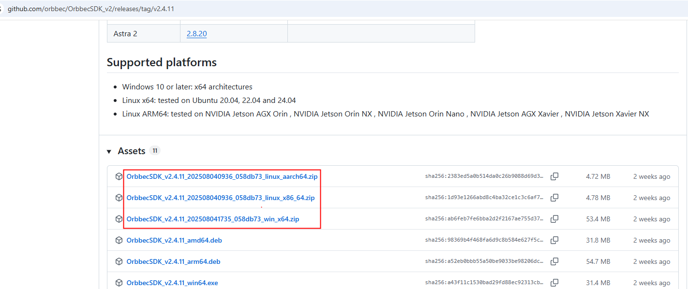
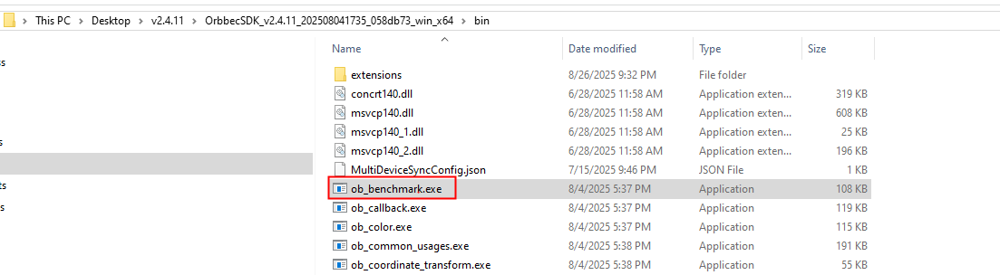
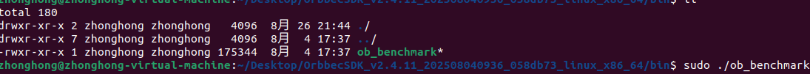
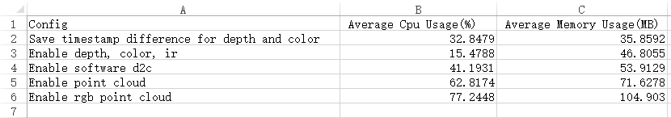
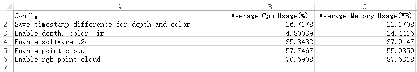

# Benchmark Tool

This tool is used to measure the performance of OrbbecSDK_v2. It can be used to measure the camera’s CPU usage, memory consumption, camera latency, and more. The benchmark tool is cross-platform and supports Windows, Linux, ARM64, and MacOS.

**Note:**
- This tool is designed for testing the **Gemini 330** series cameras. If you are using other camera, it may cause some issues (e.g., non-Gemini 330 series do not support hardware noise removal). You can modify the code in this project according to your needs.
- The benchmark tool includes two methods: `enableSwNoiseRemoveFilter` and `enableHwNoiseRemoveFilter`. For Gemini 330 series, the Orbbec SDK v2 internally enables a software filter for noise removal by default. You can call `enableSwNoiseRemoveFilter` to enable or disable software noise removal. If you're using the latest firmware (1.4.1 firmware or later), hardware noise removal is supported, you can enable or disable the hardware noise removal filter by calling `enableHwNoiseRemoveFilter`. Disabling the software filter and enabling hardware noise removal can improve the performance of the camera.


## Usage
First, download the packaged version from the [Release page](https://github.com/orbbec/OrbbecSDK_v2/releases) of Orbbec SDK v2. In the bin directory of each platform, you will find the packaged benchmark executable: on Windows, the file is named ob_benchmark.exe, while on other platforms it is ob_benchmark.
For example, in version v2.4.11, the SDK download link is as follows:



On the Windows platform, double-click ob_benchmark.exe to run the tool.



On platforms other than Windows, run the tool using `sudo ./ob_benchmark`, as shown in the figure below.


### CPU and Memory Consumption
The current benchmark tool runs five test cases by default, Each test case runs for **five minutes**.

|    Test Case    |                     Note                      |
| --- | --- |
| Measure the latency of depth and color streams  |   1. Enable depth and color streams using the default resolutions defined in the OrbbecSDKConfig.xml. Measure the latency and save the results in a .csv file. <br /> 2. Disable Software Noise Remove Filter   <br /> 3. Disable hardware Noise Remove Filter         |
| Get depth, color, left IR, and right IR streams |  1. Enable depth,color,left IR, right IR using the default resolutions   <br />  2. Disable Software Noise Remove Filter   <br /> 3. Disable hardware Noise Remove Filter                  |
| Software D2C         |  1. Enable depth and color streams using the default resolutions  <br /> 2. Disable Software Noise Remove Filter   <br /> 3. Enable hardware Noise Remove Filter  <br /> 4.  Enable Software D2C Filter              |
| Depth point cloud         |  1.  Enable depth stream using the default resolutions  <br />  2. Disable Software Noise Remove Filter   <br /> 3. Enable hardware Noise Remove Filter  <br /> 4. Enable depth point cloud filter          |
| Color point cloud     |   1.  Enable depth and color streams using the default resolutions  <br />  2. Disable Software Noise Remove Filter   <br /> 3. Enable hardware Noise Remove Filter  <br /> 4. Enable RGBD point cloud filter                    |

After the benchmark tool finishes, a `summary.csv` file will be generated in the same directory as the executable. This file contains the average results of the five test cases. For example, the following demonstrates on AGX Orin (Arm64 Ubuntu 22.04, JetPack 6.2, 64GB RAM).

- Test results of the 335L on AGX Orin with Libuvc backend 



- Test results of the 335L on AGX Orin with V4l2 backend 


**In OrbbecSDKConfig.xml, the default backend is libuvc. To switch to V4L2, find the corresponding device entry in the configuration file and modify the backend setting as shown below.**
~~~
<LinuxUVCDefaultBackend>V4L2</LinuxUVCDefaultBackend>
~~~

**Notes:**
CPU usage includes the CPU consumed by writing CSV files. 

### Depth and Color latency
- The test cases for measuring the latency of depth and color streams will generate two .csv files: `xxx_timestamp_difference_color.csv` and `xxx_timestamp_difference_depth.csv`, where `xxx` represents the camera's serial number. The latency is represented by the difference between the system timestamp and the device timestamp. 

## Advanced requirements
The benchmark included in the SDK zip package only supports the Gemini 330 series. If you need to test other devices or add additional test items, you will need to modify the benchmark code. To do this, download the SDK source code, make the necessary changes, and then recompile it.

### Step 1: Clone the repository
```bash
git clone https://github.com/orbbec/OrbbecSDK_v2.git
```

### Step 2: Build the SDK
You can build the SDK by following the instructions in the [build guide](https://github.com/orbbec/OrbbecSDK_v2/blob/main/docs/tutorial/building_orbbec_sdk.md).


### Modifying Test Cases

If you wish to modify the test time for each group of test cases, follow these steps:
1. Locate the `config/PerformanceConfig.hpp` file in the benchmark project.
2. Modify the `RECONDING_TIME_SECONDS` value, for example:
```cpp
#define RECONDING_TIME_SECONDS 60 * 3 // Modified to 3 minutes
```

If you would like to modify the test cases, follow these steps:
1. Locate the `config/PerformanceConfig.hpp` file in the benchmark project.
2. Modify the `updateConfigHandlers_` array, for example:
```cpp
updateConfigHandlers_ = {
    [](std::shared_ptr<DeviceResource>& deviceResource) -> std::string {}, // test 1
    [](std::shared_ptr<DeviceResource>& deviceResource) -> std::string {}, // test 2
    // Add your code here, for example:
    [](std::shared_ptr<DeviceResource>& deviceResource) -> std::string {
        // Summary.csv title
        std::string msg = "Enable depth[848*480/15fps Y16], color[848*480/15fps BGR]";
        std::cout << msg << std::endl;

        auto config = std::make_shared<ob::Config>();
        config->enableVideoStream(OB_SENSOR_DEPTH, 848, 480, 15, OB_FORMAT_Y16);
        config->enableVideoStream(OB_SENSOR_COLOR, 848, 480, 15, OB_FORMAT_BGR);

        deviceResource->startStream(config);
        return msg;
    },
};
```
After modifying the test case, recompile the benchmark project and run the benchmark program again. You will see the results of the newly added test case.

### Test Filtering Effects
If you would like to test the effect of certain filters, follow these steps to modify the benchmark code.
Example: Enable `Spatial Filtering`
1. Add a `spatial_filter_` member variable in `src/DeviceResource.hpp`:
```cpp
class DeviceResource {
public:
    // Other methods...

private:
    // Other members...

    // Post-processing filters
    std::shared_ptr<ob::SpatialAdvancedFilter> spatial_filter_;
};
```

2. Initialize the filter in the `DeviceResource` constructor in `src/DeviceResource.cpp`:
```cpp
DeviceResource::DeviceResource(std::shared_ptr<ob::Device> device) {
    // Initialize the spatial filter
    spatial_filter_ = std::make_shared<ob::SpatialAdvancedFilter>();
}
```

3. Modify the `startStream` function in `src/DeviceResource.cpp` to process the frames:
```cpp
void DeviceResource::startStream(std::shared_ptr<ob::Config> config) {
    pipeline_->start(config, [this](std::shared_ptr<ob::FrameSet> frameset) {
        if(frameset == nullptr) {
            return;
        }
        std::lock_guard<std::mutex> lock(mutex_);
        frames_ = frameset;

        // ====================
        // your code here
        if(spatial_filter_) {
            frames_ = spatial_filter_->process(frames_);
        }
        // your code here
        // ====================
        
        // Note: It is not recommended to handle d2c or point cloud consuming operations in the callbacks set by the pipeline.
        if(is_align_filter_enabled_ && align_filter_) {
            frames_ = align_filter_->process(frames_);
        }

        if(is_point_cloud_filter_enabled_ && point_cloud_filter_) {
            frames_ = align_filter_->process(frames_);
            point_cloud_filter_->process(frames_);
        }
    });
}
```


